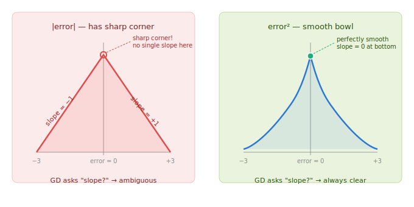
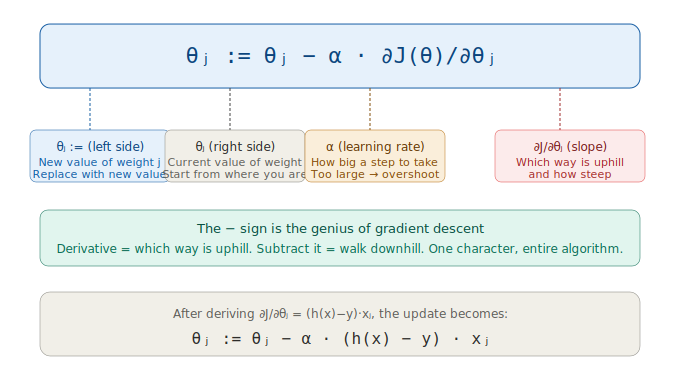
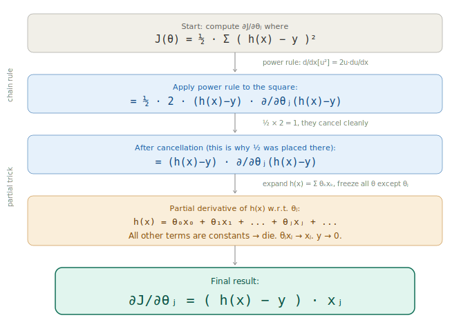
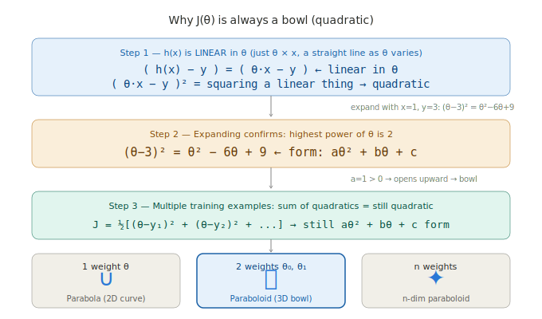
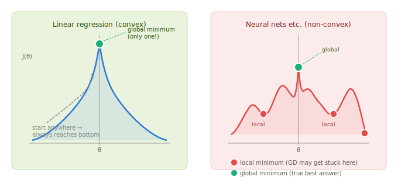
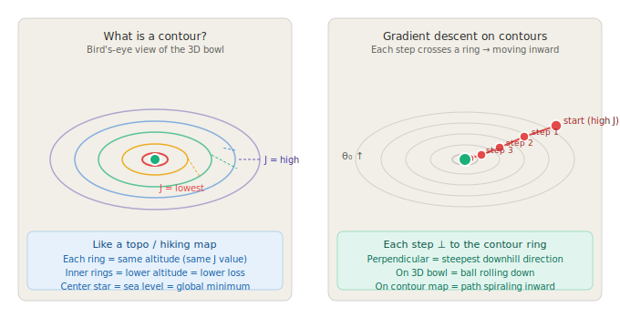
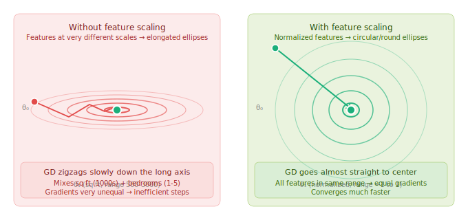

# CS229 Lecture 2 — Linear Regression & Gradient Descent

> **Session Date:** 2026-07-02
> **Duration context:** Deep-dive (extended — includes contours, global optima, and quadratic proof)
> **Tags:** `#linear-regression` `#gradient-descent` `#cost-function` `#partial-derivatives` `#chain-rule` `#contour-plots` `#convexity` `#global-optima` `#cs229` `#andrew-ng` `#ml-fundamentals`

---

## Overview

This session walked through Andrew Ng's CS229 Lecture 2 (Autumn 2018), unpacking every formula that appears on the board from minute 8 through minute 35. Covered the hypothesis function, dummy feature trick, cost function J(θ), gradient descent update rule, full chain rule derivation of (h(x)−y)·xⱼ, why J(θ) is always a quadratic bowl (and what that means algebraically), global vs local optima, and contour plots. Every design decision was explained from first principles with analogies rooted in Indian real estate and cricket.

---

## Core Concepts

### 1. The Hypothesis Function

**Formula:**
```
h(x) = θ₀ + θ₁x₁ + θ₂x₂
```

Or in compact sum form:
```
h(x) = Σ θⱼxⱼ   (j from 0 to n)
```

**What it means in plain English:**
> "Base price + (price per sq ft × area) + (price per bedroom × bedrooms)"

This is exactly the mental math you do when evaluating a flat in Pimple Saudagar.

| Symbol | What it is | Example (house price) |
|--------|-----------|----------------------|
| `h(x)` | Model's prediction | ₹54L predicted price |
| `x₁, x₂` | Features / inputs from your data | sq ft, number of bedrooms |
| `θ₀` | Base price (bias/intercept) | ₹10L — even a 0 sqft plot costs something |
| `θ₁` | Weight for x₁ | ₹500 per sq ft |
| `θ₂` | Weight for x₂ | ₹2L per bedroom |

**Key insight:** The x values come from your dataset. The θ values are what the model *learns* via gradient descent.

---

### 2. The Dummy Feature x₀ = 1

Andrew defines x₀ = 1 so that θ₀ also has an x next to it:

```
h(x) = θ₀x₀ + θ₁x₁ + θ₂x₂     (x₀ = 1, so θ₀×1 = θ₀)
```

**Why?** Without it, θ₀ is a special case with no feature — you can't write the whole thing as a clean sum `Σ θⱼxⱼ`. With x₀ = 1, every term has the same shape, so the feature vector becomes `[1, x₁, x₂]` and theta becomes `[θ₀, θ₁, θ₂]`, and their dot product gives h(x) in one operation.

**Cricket analogy:** If you want to say "total = extras + (runs per over × overs)", you could treat extras as a special case — or you could say "extras = extras × 1" and now everything is in the same `(rate × count)` format. Same result, cleaner math.

x₀ = 1 is called the **bias term** and appears in almost every ML model including neural networks.

---

### 3. The Cost Function J(θ)

**Formula:**
```
J(θ) = ½ · Σ ( h(xⁱ) − yⁱ )²
```

**Why each part is there:**

**Why square the difference?**
Three reasons working together:
1. **Kills the sign** — +10 and −10 errors cancel if you sum raw differences. Squaring makes both positive.
2. **Punishes big mistakes harder** — error of 10 → cost 100; error of 20 → cost 400. Twice as wrong = four times the penalty.
3. **Smooth and differentiable everywhere** — gives a clean parabola (bowl shape) that gradient descent can roll down without getting stuck.

**Why not use absolute value |error|?**
The absolute value function has a **sharp corner at zero** — the slope jumps instantly from −1 to +1 with no smooth transition. At exactly that point, two valid slopes exist (−1 and +1) so the derivative is undefined. Gradient descent needs to ask "which way is downhill?" at every point, and at the corner there is no clear answer. (This variant is called MAE — Mean Absolute Error — and is used in practice but needs special handling.)



**Why the ½?**
Pure cleanup. When you differentiate (h−y)², the power rule brings down a 2. Multiplying by ½ in advance cancels it:
```
d/dθ [½·(h−y)²] = (h−y)·...
```
The ½ doesn't change where the minimum is — it just keeps the gradient formula clean. Andrew placed it there knowing the derivative was coming.

---

### 4. Partial Derivatives vs Regular Derivatives

**Regular derivative** — one variable:
```
J(θ) = θ²   →   dJ/dθ = 2θ
```

**Partial derivative** — multiple variables (θ₀, θ₁, θ₂):
```
∂J/∂θ₁ = "how does J change if I nudge only θ₁, holding θ₀ and θ₂ frozen?"
```

The ∂ symbol (instead of d) signals: "there are other variables around, but I'm ignoring them right now."

**Cricket analogy:** "How much does the team total change if Virat scores one more run?" — you're holding Rohit and extras fixed and only watching Virat. That's a partial derivative.

The mechanics of computing a partial derivative are **identical** to regular derivatives — same power rule, same chain rule — you just mentally cross out the other variables while you work.

---

### 5. The Gradient Descent Update Rule

**Formula:**
```
θⱼ := θⱼ − α · ∂J(θ)/∂θⱼ
```



| Part | Meaning |
|------|---------|
| `θⱼ :=` | Replace θⱼ with a new value |
| `θⱼ` (RHS) | Current value — start from where you are |
| `α` | Learning rate — how big a step to take |
| `∂J/∂θⱼ` | Slope of the loss at your current position (which way is uphill, how steep) |
| `− sign` | Subtract the slope → walk **downhill** |

**The entire algorithm in one sentence:** Take a small step in the direction that reduces loss.

**The − sign is the genius of gradient descent.** The derivative tells you which way is uphill. Subtracting it walks you downhill. One character, entire algorithm.

**Learning rate α sensitivity:**
- Too large → overshoot the minimum, bounce around
- Too small → crawl and take forever to converge
- Just right → smooth convergence to the bottom of the bowl

**Connection to Karpathy / PyTorch:**
- `∂J/∂θⱼ` is what `.backward()` computes (backprop fills in the gradients)
- `θⱼ := θⱼ − α · gradient` is what `optimizer.step()` applies
- Andrew is building the same thing from scratch, without the library

---

### 6. Full Derivation — How Andrew Reaches (h(x) − y) · xⱼ

Starting from:
```
J(θ) = ½ · Σ ( h(x) − y )²
```

We want: `∂J/∂θⱼ`

**Step 1 — Power rule on the square (chain rule outer layer):**
```
∂J/∂θⱼ = ½ · 2 · (h(x) − y) · ∂/∂θⱼ (h(x) − y)
```

**Step 2 — ½ × 2 cancel:**
```
∂J/∂θⱼ = (h(x) − y) · ∂/∂θⱼ (h(x) − y)
```

**Step 3 — Expand h(x) and apply partial derivative:**
```
h(x) = θ₀x₀ + θ₁x₁ + θ₂x₂ + ...

∂/∂θⱼ (h(x) − y) = ∂/∂θⱼ (Σ θₖxₖ − y)
```

Freeze all θ's except θⱼ:
- Every term `θₖxₖ` where k ≠ j → treated as constant → derivative = 0
- The term `θⱼxⱼ` → derivative = **xⱼ**
- `y` is a data label (constant) → derivative = 0

**Step 4 — Final result:**
```
∂J/∂θⱼ = (h(x) − y) · xⱼ
```

So the full update rule becomes:
```
θⱼ := θⱼ − α · (h(x) − y) · xⱼ
```



**Three moves total:**
1. Power rule → brings down 2, cancels with ½
2. Chain rule → differentiate the inside too
3. Partial derivative of h(x) w.r.t. θⱼ → all other terms die, only xⱼ survives

**Intuition behind (h(x)−y)·xⱼ:**

| Factor | What it captures |
|--------|-----------------|
| `(h(x) − y)` | How wrong were you, and in which direction? Positive = over-predicted, negative = under-predicted, zero = perfect |
| `xⱼ` | How much did feature j contribute? Large xⱼ = θⱼ had big influence = deserves bigger correction |

**Cricket analogy:** You predicted Virat would score 80, he scored 50. Error = 30. If the "home ground" feature (x₁) was large (strong home advantage), that feature gets blamed more and θ₁ gets corrected harder. A feature that wasn't active (xⱼ ≈ 0) gets no blame.

---

### 7. Why J(θ) Is a Quadratic Bowl — The Algebra

**User question that triggered this:** "Linear regression is quadratic — but why? And why bowl?"

The chain of logic:

1. `h(x) = θ·x` is **linear** in θ — just a straight line as θ varies
2. `(h(x) − y) = (θ·x − y)` is still linear in θ
3. Squaring a linear expression always gives a **quadratic**: `(θ·x − y)² = aθ² + bθ + c`
4. A quadratic with positive leading coefficient (a > 0) **always opens upward** — that's a bowl
5. Summing over many training examples: sum of quadratics = still quadratic = still a bowl

```
Concrete example (x=1, y=3):
J(θ) = ½·(θ−3)² = ½·(θ²−6θ+9) = 0.5θ² − 3θ + 4.5
                    ↑
               aθ² + bθ + c form. a=0.5 > 0 → opens upward.
```



**The progression by number of weights:**

| Weights | Shape | Name |
|---------|-------|------|
| 1 (θ) | Parabola in 2D | Curve with one bottom |
| 2 (θ₀, θ₁) | Paraboloid in 3D | Cereal bowl / satellite dish |
| n (θ₀…θₙ) | n-dim paraboloid | Same guarantee, unvisualizable |

**Key point:** In all cases, there is exactly one lowest point. The bowl shape makes it mathematically impossible to have two different bottoms.

---

### 8. Global Optima — Why Linear Regression Has No Local Traps

Andrew makes a big deal of this at ~minute 30–35 because it's a rare guarantee.

**Convex function:** A function where drawing a line between any two points on the curve, that line stays above (or on) the curve. A bowl satisfies this. A bumpy mountain range doesn't.

**Consequence:** A convex function has **only one lowest point — the global minimum.** No valley inside a valley, no place where gradient descent can get stuck.



| Linear Regression (convex) | Neural Nets etc. (non-convex) |
|---------------------------|-------------------------------|
| Single perfect bowl | Bumpy surface, many valleys |
| One global minimum | Many local minima |
| GD always finds the best answer | GD can get stuck |
| Guaranteed convergence | No guarantee — depends on init, architecture |

**Why this matters:** Most ML models (deep networks, etc.) are non-convex. Training them is hard and involves tricks (random restarts, momentum, careful initialization). Linear regression doesn't need any of that — the bowl shape makes it bulletproof.

---

### 9. Contour Plots — The Bird's-Eye View

**What is a contour?**
Imagine pouring water into the 3D bowl at different heights and photographing each waterline from directly above. Each waterline is a **contour** — a ring where J(θ) has the same value all the way around. Like altitude lines on a hiking / topo map.

- Innermost ring = lowest loss
- Outer rings = higher loss
- Center point = global minimum

**Why Andrew draws contours instead of 3D bowls:**
- Easier to draw on a blackboard
- Easier to show gradient descent steps as arrows
- Richer information visible (shape of ellipses reveals learning dynamics)

**Gradient descent on contour plots:**
Each GD step moves **perpendicular to the nearest contour ring** — that's the steepest downhill direction. The path spirals inward, crossing rings as it goes, until it reaches the center.



**What the ellipse shape tells you:**

The shape of the contours is not just aesthetic — it reveals how the loss behaves in each direction.



| Contour shape | Cause | Consequence |
|---------------|-------|-------------|
| Narrow / elongated ellipses | Features at very different scales (sq ft vs bedrooms) | GD zigzags slowly, inefficient |
| Circular / round ellipses | Features normalized to same range | GD goes straight to center, fast convergence |

This is exactly why **feature scaling / normalization** matters — it rounds out the ellipses and makes gradient descent converge much faster.

---

## Diagrams

### Absolute value vs squared error


Shows why the V-shape of |error| has an undefined slope at zero (sharp corner), while error² gives a smooth bowl with a well-defined slope everywhere.

### Gradient descent update rule decoded


Every symbol in `θⱼ := θⱼ − α · ∂J/∂θⱼ` annotated, plus the final expanded form `θⱼ := θⱼ − α·(h(x)−y)·xⱼ`.

### Chain rule derivation


The complete step-by-step derivation: power rule → ½ cancels 2 → chain rule → partial of h(x) gives xⱼ.

### Global vs local optima


Side-by-side comparison: the perfect bowl of linear regression vs a bumpy non-convex surface with multiple local minima.

### Contour plot with gradient descent path


Left: what contours are (bird's-eye view of bowl, rings = same J value). Right: gradient descent steps spiraling inward toward the global minimum.

### Contour shape and feature scaling


How elongated contours (unscaled features) cause GD to zigzag, while circular contours (normalized features) let GD converge directly.

---

## Comparisons & Tradeoffs

### Absolute Error vs Squared Error

| Property | \|error\| (MAE) | error² (MSE) |
|----------|----------------|-------------|
| Kills sign problem | Yes | Yes |
| Differentiable everywhere | No (corner at 0) | Yes (smooth bowl) |
| Punishes outliers | Linearly | Quadratically |
| Works with gradient descent cleanly | Needs special handling | Yes, naturally |
| Used in practice | Yes (robust tasks) | Yes (standard regression) |

### Convex vs Non-Convex Loss Surfaces

| Property | Convex (linear regression) | Non-convex (deep learning) |
|----------|---------------------------|---------------------------|
| Shape | Perfect bowl | Bumpy, many valleys |
| Local minima | None | Many |
| GD guarantee | Always finds global minimum | No guarantee |
| Starting point matters | No | Yes, critically |
| Example | Linear regression, logistic regression | Neural networks |

---

## Key Takeaways

- `h(x) = Σ θⱼxⱼ` is just a weighted sum of features — the θ's are what the model learns, the x's are your data
- `x₀ = 1` (dummy feature) exists purely so θ₀ fits the same `θⱼxⱼ` pattern — allows compact matrix math and uniform treatment
- The ½ in J(θ) is placed intentionally to cancel the 2 that appears when you differentiate the square
- Squaring the error is chosen because it is smooth (differentiable everywhere), sign-agnostic, and outlier-penalizing — unlike |error| which has an undefined derivative at 0
- The − sign in gradient descent is the whole algorithm: derivative tells you uphill, subtracting walks you downhill
- `∂J/∂θⱼ = (h(x)−y)·xⱼ` comes from three mechanical steps: power rule → chain rule → partial derivative of h(x) gives xⱼ
- The partial derivative of h(x) w.r.t. θⱼ is simply xⱼ — all other terms in the sum vanish
- J(θ) is quadratic (bowl-shaped) because squaring a linear-in-θ expression always gives aθ² + bθ + c with a > 0
- Quadratic = only one bottom = guaranteed single global minimum — this is what "convex" means
- Contour plots are the bird's-eye view of the 3D bowl — each ring = same loss value, innermost ring = lowest loss
- Elongated contour ellipses mean features are at very different scales → GD zigzags slowly; round ellipses mean features are normalized → GD goes straight to center
- Feature scaling / normalization rounds out the contour ellipses and makes gradient descent converge faster
- This is exactly what PyTorch's `.backward()` + `optimizer.step()` does — Andrew is building the math behind the library

---

## Open Questions / Next Steps

- What does the update rule look like when summed over **multiple training examples** (batch gradient descent)?
- What is the difference between batch, stochastic, and mini-batch gradient descent?
- How does Andrew derive the **normal equation** (closed-form solution θ = (XᵀX)⁻¹Xᵀy) as an alternative to iterative GD?
- When does gradient descent fail to converge — what does the loss curve look like when α is too large?
- How does **feature scaling / normalization** work in practice (min-max, z-score)?
- What happens to convexity guarantee when we add regularization (L1/L2)?

---

## References

- **Lecture:** Stanford CS229 Machine Learning — Lecture 2 (Autumn 2018), Andrew Ng
- **Related:** Andrej Karpathy "Neural Networks: Zero to Hero" series (micrograd, backprop ninja) — same math, library-free
- **Concepts covered:** Linear regression, hypothesis function, cost function (MSE), gradient descent, partial derivatives, chain rule, convexity, global optima, contour plots, feature scaling
