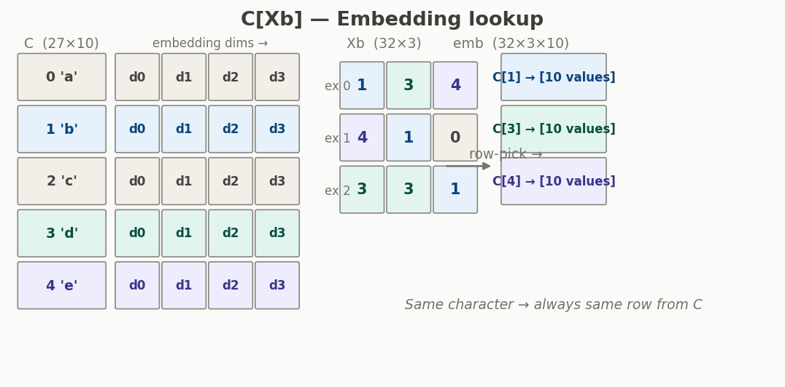
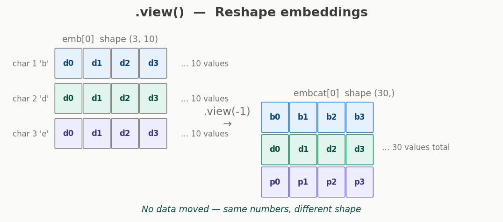
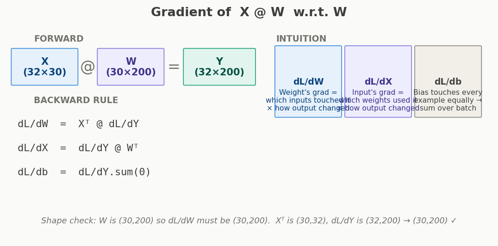
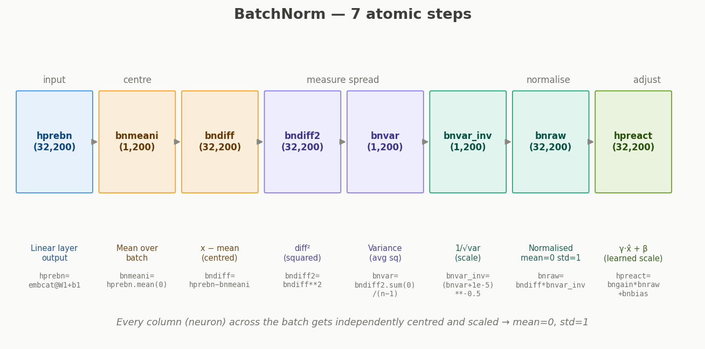
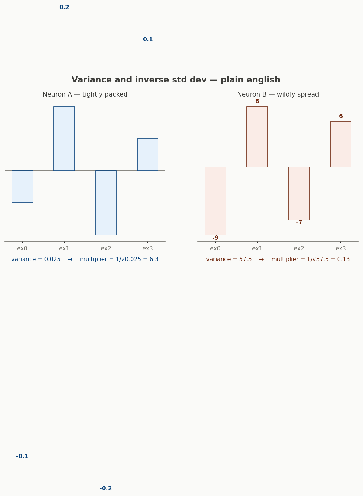
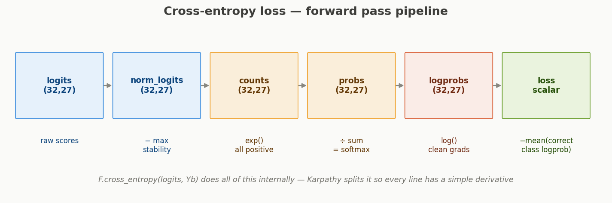

# Backprop Ninja — Study Notes
### Karpathy Zero to Hero · Makemore Part 4

> These notes cover the full forward pass of the 2-layer MLP with BatchNorm,  
> built up concept by concept from first principles.

---

## Table of Contents

1. [What this lecture is about](#1-what-this-lecture-is-about)
2. [The forward pass — big picture](#2-the-forward-pass--big-picture)
3. [Step 1 — Embedding lookup `C[Xb]`](#3-step-1--embedding-lookup-cxb)
4. [Step 2 — Reshape `.view()`](#4-step-2--reshape-view)
5. [Step 3 — Linear Layer 1 `@ W1 + b1`](#5-step-3--linear-layer-1--w1--b1)
6. [Step 4 — BatchNorm (all 7 sub-steps)](#6-step-4--batchnorm-all-7-sub-steps)
7. [Step 5 — Activation `tanh`](#7-step-5--activation-tanh)
8. [Step 6 — Linear Layer 2 `@ W2 + b2`](#8-step-6--linear-layer-2--w2--b2)
9. [Step 7 — Cross-Entropy Loss](#9-step-7--cross-entropy-loss)
10. [Key mental models](#10-key-mental-models)

---

## 1. What this lecture is about

Karpathy takes the 2-layer MLP (with BatchNorm) from Part 3 and **manually writes every single backward pass step** — without calling `loss.backward()`.

The goal is not to replace PyTorch. The goal is to understand what PyTorch is doing, so you can:
- Debug training problems with real intuition
- Innovate on architectures confidently
- Read research papers that derive custom gradients

**The key idea behind splitting everything into atoms:**  
Each primitive operation (multiply, add, exp, log, sum…) has a simple one-line derivative.  
The chain rule then connects them. You never need calculus for the whole expression at once — only ever for one operation at a time.

---

## 2. The forward pass — big picture

The full pipeline from characters to loss:

```
Characters (indices)
    ↓  C[Xb]           embedding lookup
    ↓  .view()         flatten per example
    ↓  @ W1 + b1       linear layer 1
    ↓  BatchNorm       normalise activations
    ↓  tanh            non-linearity
    ↓  @ W2 + b2       linear layer 2
    ↓  cross-entropy   compute loss scalar
```

The four exercises in the lecture:
1. Backprop through all atomic ops (the whole graph)
2. Collapse cross-entropy backward to one formula
3. Collapse BatchNorm backward to one formula
4. Put it all together and verify against PyTorch

---

## 3. Step 1 — Embedding lookup `C[Xb]`



### What is C?

`C` is a learned table — shape `(27, 10)`. One row per character in the vocabulary (27 characters). Each row is a 10-dimensional vector. These vectors start random and learn during training.

### What is Xb?

`Xb` is a batch of examples — shape `(32, 3)`. Each row is one training example: 3 character indices representing the context window.

### What does `C[Xb]` do?

Pure **row-picking**. No math. For every integer in `Xb`, PyTorch fetches that row from `C` and puts it in the output.

```python
emb = C[Xb]   # shape: (32, 3, 10)
#              32 examples
#               3 context positions per example
#                  10 embedding dims per character
```

**Concrete example:**

```
Xb[0] = [1, 3, 4]              # indices for 'b', 'd', 'e'

emb[0] = [
  C[1],   # row 1 of C  → vector for 'b'  → (10 numbers)
  C[3],   # row 3 of C  → vector for 'd'  → (10 numbers)
  C[4],   # row 4 of C  → vector for 'e'  → (10 numbers)
]
# shape: (3, 10)
```

**Key intuition:**  
The same character always gets the same vector. If 'b' (index 1) appears 50 times in the batch, all 50 get the exact same row from `C`. During backprop, gradients from all 50 occurrences accumulate into that one row — updating how the network represents 'b'.

---

## 4. Step 2 — Reshape `.view()`



### Why reshape?

After `C[Xb]`, each example is a `(3, 10)` grid — 3 character vectors of 10 dims each. The next operation (`@ W1`) expects a flat vector per example. So we flatten the `3 × 10 = 30` values into one row.

```python
embcat = emb.view(emb.shape[0], -1)
# emb.shape[0] = 32   → keep the batch dimension
# -1            = 30  → PyTorch computes: 3 × 10 = 30

# (32, 3, 10)  →  (32, 30)
```

### How gradient flows through reshape

`.view()` does **not move or compute anything**. It just reinterprets the shape of the same block of memory.

Because of this, the backward pass is trivial:

```
Forward:   emb (32,3,10)  →  .view()  →  embcat (32,30)
Backward:  d_embcat (32,30)  →  .view(32,3,10)  →  d_emb (32,3,10)
```

Every gradient value drops straight back to where its forward value came from. No scaling, no new math.

**Rule:** gradient of input to a reshape = gradient of output, reshaped back.

---

## 5. Step 3 — Linear Layer 1 `@ W1 + b1`



```python
hprebn = embcat @ W1 + b1
# embcat: (32, 30)
# W1:     (30, 200)
# b1:     (200,)
# hprebn: (32, 200)
```

### What it does

Each of 32 examples has a 30-dim vector. `W1` maps 30 dims → 200 hidden dims. Each of 200 output neurons is a weighted sum of all 30 inputs, plus a bias.

### Gradient of a matrix multiply

For `Y = X @ W`:

| What we want | Formula | Intuition |
|---|---|---|
| `dL/dW` | `Xᵀ @ dL/dY` | Weight's grad = inputs that touched it × how output changed |
| `dL/dX` | `dL/dY @ Wᵀ` | Input's grad = weights that used it × how output changed |
| `dL/db` | `dL/dY.sum(0)` | Bias touches every example → sum over batch |

**Shape check (always do this):**  
`W` is `(30, 200)` so `dL/dW` must be `(30, 200)`.  
`Xᵀ` is `(30, 32)`, `dL/dY` is `(32, 200)` → product is `(30, 200)` ✓

**In Karpathy's code:**
```python
dW1     = embcat.T @ dhprebn
dembcat = dhprebn @ W1.T
db1     = dhprebn.sum(0)
```

**The one sentence:** a weight's gradient is "which inputs multiplied it" dotted with "how much the output changed." The transpose just makes the shapes work out.

---

## 6. Step 4 — BatchNorm (all 7 sub-steps)



### Why BatchNorm exists

After the linear layer, different neurons have wildly different scales. Neuron A might output values around 0.1, neuron B around 500. This makes training unstable — tanh saturates on B while A is fine. BatchNorm forces every neuron onto the same scale.

### The 7 steps

#### Step 4.1 — Compute the batch mean

```python
bnmeani = 1/n * hprebn.sum(0, keepdim=True)
# shape: (1, 200)
```

For each of 200 neurons, average its value across all 32 examples. One mean per neuron. `sum(0)` means "collapse the batch dimension."

**Plain English:** look down each column, compute the average. Now you know where each neuron is centred.

---

#### Step 4.2 — Subtract the mean

```python
bndiff = hprebn - bnmeani
# shape: (32, 200)
```

Subtract each neuron's mean from every value. After this, every neuron's average across the batch is exactly 0. Broadcasting: `bnmeani` is `(1, 200)` and stretches to `(32, 200)`.

**Plain English:** shift every column so it sits at zero. You can now see who's above and below average clearly.

---

#### Step 4.3 — Square the differences

```python
bndiff2 = bndiff ** 2
# shape: (32, 200)
```

Square every value. Two reasons: makes everything positive (spread can't be negative), and makes large deviations count more than small ones.

**Plain English:** −9 and +9 are equally far from zero. Squaring (81 and 81) captures this. This is preparation for computing variance.

---

#### Step 4.4 — Compute variance

```python
bnvar = 1/(n-1) * bndiff2.sum(0, keepdim=True)
# shape: (1, 200)
```

Average the squared differences — this is the variance. One number per neuron. Small variance = calm neuron. Large variance = wild neuron.

**Why n−1 not n?** Bessel's correction. We estimated the mean from this same batch, which slightly underestimates true variance if we divide by n. Dividing by n−1 corrects for this. Karpathy uses it because PyTorch's `.var()` uses n−1 by default — they need to match for the gradient check.

---

#### Step 4.5 — Inverse standard deviation

```python
bnvar_inv = (bnvar + 1e-5) ** -0.5
# shape: (1, 200)
```

This is `1 / √variance` — the exact multiplier needed to bring any neuron's spread to 1.



**Why the inverse?**

```
current spread  ×  k  =  1  (target)
                   k  =  1 / current spread
                   k  =  1 / √variance
```

- Neuron A: variance = 0.025, std = 0.16 → multiplier = **6.3** (stretch it up)
- Neuron B: variance = 57.5,  std = 7.58 → multiplier = **0.13** (squish it down)

**Why `** -0.5` instead of `1/sqrt()`?**  
It's one atomic operation with one clean derivative: `d/dx (x**-0.5) = -0.5 * x**-1.5`. Writing `1/torch.sqrt(bnvar)` would be two nodes in the compute graph (sqrt, then divide), requiring two backward steps.

**Why `+ 1e-5`?**  
If variance is exactly 0 (all examples gave the same value), we'd divide by zero. Adding a tiny epsilon prevents this.

---

#### Step 4.6 — Normalise

```python
bnraw = bndiff * bnvar_inv
# shape: (32, 200)
```

Multiply the centred values by the scaling factor. This is the z-score: `(x − μ) / σ`. After this, every neuron has mean ≈ 0 and std ≈ 1 across the batch.

**Plain English:** each value is now expressed as "how many standard deviations from the average." A value of +1.5 means 1.5 std devs above the batch average for that neuron.

---

#### Step 4.7 — Scale and shift (learned)

```python
hpreact = bngain * bnraw + bnbias
# bngain: (1, 200) — starts at 1
# bnbias: (1, 200) — starts at 0
# hpreact: (32, 200)
```

`bngain` (γ) and `bnbias` (β) are learned parameters. At initialisation they do nothing (1 × bnraw + 0). During training the network can learn to re-scale if needed — giving it flexibility to say "neuron 7 actually works better at mean=2, std=3."

**Why add this if we just normalised?** Pure normalisation is too rigid. Forcing everything to stay at mean=0, std=1 forever would limit what the network can represent. γ and β are the safety valve.

---

### BatchNorm — why the backward is hard

In every other operation, each example's gradient depends only on that example's forward values.

In BatchNorm, every example's output depends on the **entire batch's mean and variance**. So when computing the gradient for one example, you have to account for 3 paths:
1. Direct path: `x → x̂`
2. Via mean: `x → μ → all x̂`
3. Via variance: `x → σ² → all x̂`

This coupling is what makes Exercise 3 the hardest in the lecture.

---

## 7. Step 5 — Activation `tanh`

```python
h = torch.tanh(hpreact)
# shape: (32, 200)  — same shape, values squashed to (−1, +1)
```

Applied element-wise. Squashes every value into `(−1, +1)`. This introduces non-linearity — without it, stacking linear layers gives you one big linear layer no matter how deep you go.

**Gradient:** `d(tanh(x))/dx = 1 − tanh²(x) = 1 − h²`

The forward value `h` is reused in the backward pass directly. If `h ≈ ±1` (saturated), gradient ≈ 0 — weights stop learning. This is the vanishing gradient problem.

---

## 8. Step 6 — Linear Layer 2 `@ W2 + b2`

```python
logits = h @ W2 + b2
# h:      (32, 200)
# W2:     (200, 27)
# b2:     (27,)
# logits: (32, 27)
```

Maps 200 hidden units → 27 output scores (one per vocabulary character). Same gradient rules as Linear Layer 1.

---

## 9. Step 7 — Cross-Entropy Loss



`F.cross_entropy(logits, Yb)` does this entire pipeline internally. Karpathy splits it into 6 atomic lines so each has a simple derivative.

### Step 7.1 — Subtract the max (numerical stability)

```python
logit_maxes = logits.max(1, keepdim=True).values
norm_logits = logits - logit_maxes
# shape: (32, 27)
```

Find the largest logit per row, subtract it. The largest value becomes 0, everything else negative. This prevents `exp()` from producing `inf` (e.g. `exp(900) = ∞`). The final probabilities are mathematically identical — the subtraction cancels out.

---

### Step 7.2 — Exponentiate

```python
counts = norm_logits.exp()
# shape: (32, 27) — all values strictly positive
```

`e^x` makes everything positive and preserves ordering (larger logit = larger count). After this, values range from near-0 (low-confidence characters) to 1.0 (the highest logit, which became 0 before exp).

---

### Step 7.3 — Divide by sum = softmax

```python
counts_sum     = counts.sum(1, keepdim=True)      # shape: (32, 1)
counts_sum_inv = counts_sum ** -1                  # shape: (32, 1)
probs          = counts * counts_sum_inv           # shape: (32, 27)
```

Divide every count by the row total. Now each row sums to 1 — these are valid probabilities. This is **softmax**.

Karpathy writes `counts_sum ** -1` instead of `1/counts_sum` because `x**-1` is one atomic operation with derivative `-x**-2`. Two separate operations would mean two backward steps.

---

### Step 7.4 — Log probabilities

```python
logprobs = probs.log()
# shape: (32, 27) — all values ≤ 0
```

`log(probability)` is always ≤ 0 (since probabilities ≤ 1). Perfect prediction (prob=1) gives log=0. Terrible prediction (prob=0.001) gives log=−6.9.

Why log? Three reasons:
1. Turns "prob close to 1 = good" into "logprob close to 0 = good"
2. Prevents numerical underflow with tiny probabilities
3. Derivative of log is `1/x` — one of the cleanest possible

---

### Step 7.5 — Pick correct class, negate, average

```python
loss = -logprobs[range(n), Yb].mean()
# shape: scalar
```

`Yb` contains the correct next-character index for each example. We index into `logprobs` to get the log-probability the network assigned to the correct answer. Negate (so lower = better, matching gradient descent convention). Average over the batch.

**Why only the correct class?**  
If the network assigns high probability to the right answer, all wrong classes must have low probability (they sum to 1). So watching only the correct class is sufficient.

**Gradient at this step:**
```
dlogprobs = zeros everywhere
dlogprobs[range(n), Yb] = -1/n     # only at correct positions
```

This sparse gradient (only 32 non-zero values out of 32×27=864) is what Karpathy calls the starting point of the backward pass.

---

### The collapsed formula (Exercise 2 answer)

After algebraically simplifying all 6 steps backward, everything collapses to:

```python
dlogits = F.softmax(logits, 1)
dlogits[range(n), Yb] -= 1
dlogits /= n
```

**Reading this:** the gradient at every logit is `(your softmax probability) − (your label)`, divided by batch size.
- Correct class: `prob − 1` (negative → push logit up)
- Wrong classes: `prob − 0 = prob` (positive → push logit down)

This is exactly `softmax(logits) − one_hot(labels)`. Karpathy shows the 6-step derivation to prove this isn't magic — it follows mechanically from the chain rule.

---

## 10. Key mental models

### Operations and their backward pass complexity

| Operation | Backward complexity | Why |
|---|---|---|
| `.view()`, reshape | Trivial — just reshape grad back | No computation, no data movement |
| `+` add | Trivial — grad passes through | Local derivative = 1 |
| `−` subtract | Trivial — grad passes through (negated on subtracted side) | Local derivative = ±1 |
| `*` elementwise multiply | Simple — swap inputs | Local derivative = the other input |
| `@ ` matrix multiply | Medium — needs transpose | Each weight touched every example |
| `exp()` | Simple — output × upstream | d(eˣ)/dx = eˣ |
| `log()` | Simple — 1/input × upstream | d(log x)/dx = 1/x |
| `x**n` | Simple — power rule | d(xⁿ)/dx = n·xⁿ⁻¹ |
| `.sum()` | Broadcasting backward | Grad fans out to all summed elements |
| `tanh` | Simple — uses forward value | d(tanh x)/dx = 1 − tanh²(x) |
| BatchNorm | Hard — coupling across batch | Mean and variance couple all examples |

### The chain rule in one line

```
dL/dW₁ = dL/d(output) · d(output)/d(sum) · d(sum)/d(x₁w₁) · d(x₁w₁)/dW₁
        =  grad_output ·   (1 − tanh²)   ·        1        ·      x₁
```

Each term is one node's local derivative. Follow the path from output → input, multiply the locals.

### When the backward pass is hard

The hard cases are always **operations that mix values together** — where one output depends on many inputs, so gradient must be split and distributed. The mean in BatchNorm is the clearest example: one mean value depends on all 32 examples, so its gradient flows back to all 32.

Contrast with elementwise operations (exp, tanh, multiply) — each output depends on exactly one input, so gradient flows back to exactly one place. Always simple.

---

*Notes generated from working through Karpathy's Zero to Hero, Makemore Part 4.*  
*Lecture: [https://www.youtube.com/watch?v=q8SA3rM6ckI](https://www.youtube.com/watch?v=q8SA3rM6ckI)*
