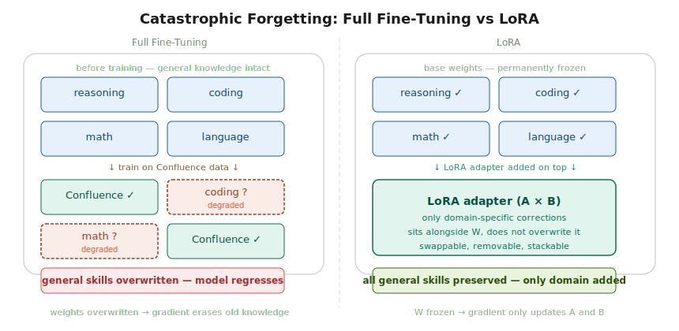
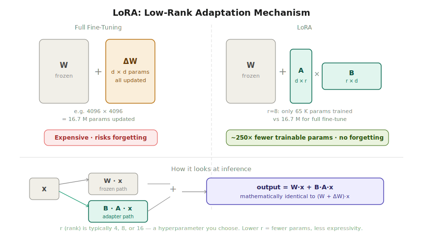
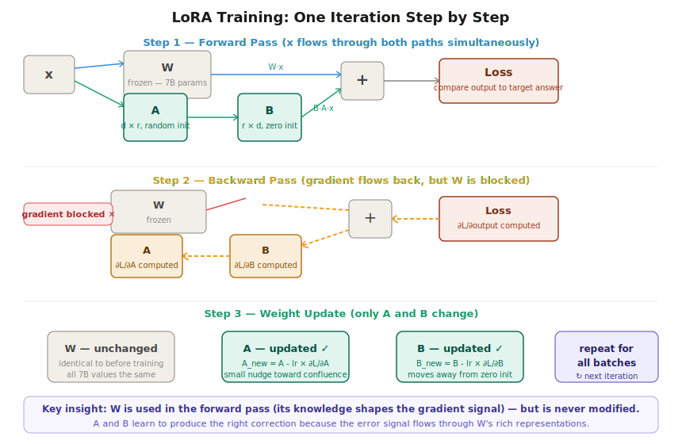
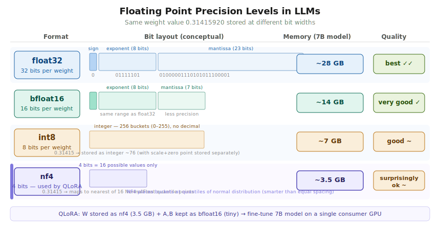
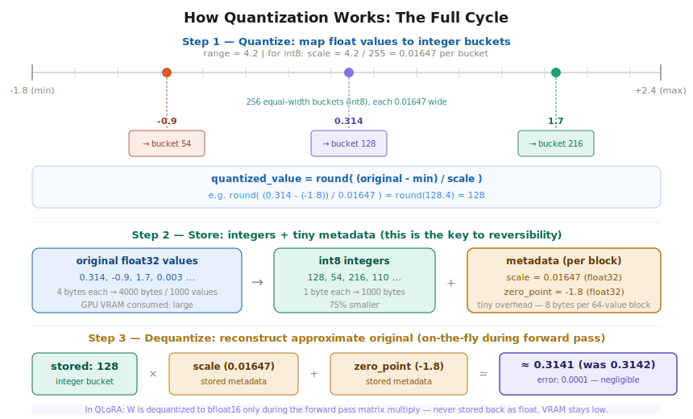
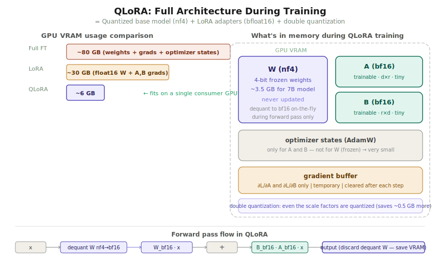
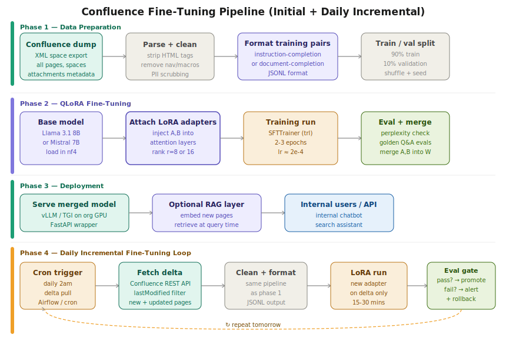

# Fine-Tuning LLMs with LoRA and QLoRA
### A complete practical guide — from first principles to production

---

## Table of Contents

1. [Why Fine-Tune at All?](#1-why-fine-tune-at-all)
2. [The Problem with Full Fine-Tuning](#2-the-problem-with-full-fine-tuning)
3. [Catastrophic Forgetting](#3-catastrophic-forgetting)
4. [LoRA: The Core Idea](#4-lora-the-core-idea)
5. [LoRA: The Math](#5-lora-the-math)
6. [How LoRA Training Actually Works](#6-how-lora-training-actually-works)
7. [LoRA Hyperparameters](#7-lora-hyperparameters)
8. [Merging Adapters](#8-merging-adapters)
9. [Quantization: Making Models Fit in Memory](#9-quantization-making-models-fit-in-memory)
10. [QLoRA: Combining Everything](#10-qlora-combining-everything)
11. [QLoRA vs LoRA vs Full Fine-Tuning — Decision Guide](#11-qlora-vs-lora-vs-full-fine-tuning--decision-guide)
12. [Applying This: Fine-Tuning on Confluence Data](#12-applying-this-fine-tuning-on-confluence-data)
13. [The Daily Incremental Pipeline](#13-the-daily-incremental-pipeline)
14. [Tooling and Stack](#14-tooling-and-stack)
15. [Common Pitfalls](#15-common-pitfalls)

---

## 1. Why Fine-Tune at All?

A base LLM like Llama 3 or Mistral has been trained on trillions of tokens from the public internet. It knows language, reasoning, code, and general knowledge extremely well. But it does not know:

- Your organisation's internal terminology (e.g. "TOPS", "Project Kestrel", your internal deployment abbreviations)
- Your Confluence pages, runbooks, architecture decisions, team norms
- The particular tone, format, and style your org expects in answers
- Implicit organisational knowledge that exists only in internal docs

Fine-tuning teaches the model this domain-specific knowledge by continuing to train it on your internal data. After fine-tuning, the model can answer questions like "what's the process for getting a new microservice deployed?" using your actual Confluence runbook — not a generic guess.

**The alternative is RAG** (Retrieval-Augmented Generation), which retrieves relevant pages at query time and feeds them as context. RAG and fine-tuning solve different problems:

| | RAG | Fine-Tuning |
|---|---|---|
| Best for | Fresh, frequently-updated content | Internalising tone, terminology, implicit knowledge |
| Update speed | Instant (re-embed the page) | Requires a training run |
| Hallucination risk | Lower (grounded in retrieved text) | Higher without eval gates |
| GPU required | No | Yes |
| Works best when | Content changes daily | Patterns and style matter as much as facts |

For Confluence: use **both**. Fine-tune for terminology and patterns, RAG for freshness.

---

## 2. The Problem with Full Fine-Tuning

"Full fine-tuning" means updating every single parameter in the model during training.

A 7-billion-parameter model has 7 billion floating-point numbers in its weight matrices. Full fine-tuning means:

- Computing gradients for all 7B parameters on every training step
- Storing optimizer states (Adam uses two momentum buffers per parameter = 14B extra numbers)
- Storing the gradients themselves (another 7B numbers)
- GPU VRAM required: **~80 GB** for a 7B model — that's multiple A100 80GB GPUs

Beyond the hardware cost, full fine-tuning has a deeper problem: **catastrophic forgetting**.

---

## 3. Catastrophic Forgetting

When you do full fine-tuning on your Confluence data, the gradient descent optimizer updates the same weight matrices that encode the model's general knowledge — its ability to reason, write code, do math, understand context.

The optimizer has no concept of "preserve what was already learned." It just pushes weights toward fitting your new data. If your Confluence dataset is 50,000 pages (say, 50M tokens), but the model was pretrained on 2 trillion tokens, the signal from your new data is proportionally enormous. The weights shift dramatically toward Confluence, and the general intelligence that took trillions of tokens to build gets overwritten.



**What you end up with after full fine-tuning on domain data:**
- Excellent answers to Confluence-specific questions
- Degraded reasoning, coding, and language capabilities
- A model that has essentially "forgotten" what made the base model useful

This is why full fine-tuning on small domain datasets is almost never the right answer. LoRA was invented specifically to solve this.

---

## 4. LoRA: The Core Idea

**LoRA** stands for **Low-Rank Adaptation** (Hu et al., 2021).

The insight behind LoRA is deceptively simple:

> The *change* you need to make to a weight matrix in order to adapt it to a new domain is **low-rank** — it lives in a much smaller subspace than the full matrix.

A transformer's attention layer has weight matrices like `W_q`, `W_k`, `W_v`, `W_o` (query, key, value, output projections). These are typically large square matrices — for a 7B model, they might be 4096×4096. Full fine-tuning would update all 16.7 million numbers in that matrix.

LoRA instead says: "Don't change W at all. Instead, add a small correction ΔW alongside it, and express ΔW as the product of two small matrices."

If `W` is a `d × d` matrix (e.g. 4096×4096), then:

```
ΔW = B × A

where:
  A is (d × r)  — e.g. 4096 × 8
  B is (r × d)  — e.g. 8 × 4096
  r is the "rank" — a small number you choose (4, 8, 16, 32...)
```

The number of parameters in `B × A` is `d×r + r×d = 2×d×r`.

For `d=4096` and `r=8`: `2 × 4096 × 8 = 65,536` parameters.

Compare that to the original matrix: `4096 × 4096 = 16,777,216` parameters.

**LoRA trains 256× fewer parameters** for this one layer. Across the whole model, the savings are similar.



### Why does this work?

Neural network weight updates during fine-tuning have been empirically shown to have a low "intrinsic dimensionality" — the actual directions in weight space that matter for learning a new task are far fewer than the full dimensionality of the matrix. LoRA exploits this: by constraining ΔW to be the product of two thin matrices (a rank-r decomposition), we're forcing it to use only the most important directions. The model can still learn what it needs to, it just can't waste parameters on noise.

---

## 5. LoRA: The Math

### Forward pass (inference or training)

Without LoRA:
```
output = W · x
```

With LoRA:
```
output = W · x  +  B · A · x
       = (W + ΔW) · x        [mathematically equivalent]
```

`W` is frozen (never updated). `B` and `A` are the only trainable parameters.

### Initialization

- **A is initialized randomly** (from a Gaussian distribution, same as normal weight init)
- **B is initialized to zero**

This is critical. At the start of training, `B · A = 0`, so the LoRA output is exactly zero. This means the model starts in exactly the same state as the base model — the adapter contributes nothing initially. If B were random instead of zero, the model would produce garbage outputs on step one and training would be chaotic.

As training progresses, B gradually moves away from zero, and the adapter starts contributing a meaningful correction to the output.

### Scaling factor (alpha)

In practice, LoRA applies a scaling factor `α/r` to the adapter output:

```
output = W · x  +  (α/r) × B · A · x
```

`α` (alpha) is a hyperparameter, often set to 16 or 32. The division by `r` normalizes the contribution of the adapter so that increasing `r` doesn't automatically increase the adapter's influence. A common default is `alpha = 2 × r`.

---

## 6. How LoRA Training Actually Works

This is where intuition breaks down for many people. The question is: **if W is frozen, how does it contribute to learning?**

The answer: **W is used in the forward pass (its knowledge shapes the error signal), but it is never modified.**



### Step-by-step: one training iteration

**Step 1 — Forward pass**

Input `x` flows through both paths simultaneously:
- Path 1: `x → W → W·x` (using frozen W, full precision)
- Path 2: `x → A → B → B·A·x` (using trainable A and B)
- Final output: `W·x + B·A·x`

This output is compared to the target answer (the "correct" response from your training data).

**Step 2 — Compute loss**

The loss function (typically cross-entropy) measures how wrong the output was. This produces a scalar number — the loss — that we want to minimize.

**Step 3 — Backward pass (backpropagation)**

PyTorch automatically computes `∂Loss/∂(every trainable parameter)` using the chain rule. The gradient flows backward through the computation graph:

- `∂L/∂B` — how should B change to reduce the loss? ✓ computed
- `∂L/∂A` — how should A change to reduce the loss? ✓ computed  
- `∂L/∂W` — how should W change? ✓ computed by PyTorch... but then **discarded** because W has `requires_grad=False`

The critical insight: **W's gradient is computed but thrown away.** W participates in shaping the gradient (because the error signal flows through it), but the parameter update step at the end ignores it.

W's rich, pretrained representations determine the quality of the gradient signal that reaches A and B. This is why A and B can learn quickly with very little data — they're learning on top of W's excellent representations, not from scratch.

**Step 4 — Update A and B**

```
A_new = A - learning_rate × ∂L/∂A
B_new = B - learning_rate × ∂L/∂B
W     = W  (unchanged)
```

Repeat for every batch in your dataset. After 2-3 epochs, A and B have been nudged thousands of times to produce domain-specific corrections.

### In plain words

> We initialise A with random values and B with zeros. As we get gradient values for W, we ignore them. We update only A and B with their own gradients. We utilise the pretrained W's knowledge in the forward pass to shape what A and B learn — but W itself never changes.

---

## 7. LoRA Hyperparameters

### Rank `r`

The single most important LoRA hyperparameter.

| r | Trainable params (7B model) | Use when |
|---|---|---|
| 4 | ~8M | Very large dataset, simple domain adaptation |
| 8 | ~16M | **Good default for most cases** |
| 16 | ~33M | Complex domains, limited data |
| 32 | ~67M | When quality matters more than efficiency |
| 64+ | ~134M+ | Approaching full fine-tuning territory |

A higher rank gives the adapter more "capacity" to learn, but also increases the risk of overfitting and uses more memory. Start with `r=8`.

### Alpha `α`

Controls scaling. Common practice: `α = 2r` (so if `r=8`, set `α=16`). Some practitioners just fix `α=16` and tune only `r`.

### Target modules

You don't have to inject LoRA into every weight matrix. Common choices:

- **Attention only** (q_proj, k_proj, v_proj, o_proj) — standard, good results
- **Attention + MLP** (adds gate_proj, up_proj, down_proj) — more capacity, more params
- **All linear layers** — maximum capacity, closest to full fine-tuning

For Confluence Q&A, attention-only is usually sufficient.

### Dropout

A `lora_dropout` of 0.05–0.1 helps regularize, especially with small datasets. Set to 0 for large datasets.

---

## 8. Merging Adapters

After training, you have two things:
1. The original frozen weights W (unchanged)
2. The trained adapter matrices A and B

At inference, you need to compute `W·x + B·A·x` at every layer, which adds a small overhead.

**Merging** fuses the adapter back into W mathematically:

```
W_merged = W + B·A
```

The result is a single weight matrix of the same shape as the original W, with the adapter's knowledge baked in permanently. Inference is then:

```
output = W_merged · x    [same as (W + B·A)·x, zero overhead]
```

### When to merge vs keep separate

| Keep separate | Merge |
|---|---|
| Daily incremental updates (swap adapters) | Production serving with fixed model |
| Multiple adapters for different departments | Lowest possible inference latency |
| A/B testing different adapter versions | Deploying to devices without adapter support |
| Rollback capability needed | One-time deployment |

For the Confluence use case with daily updates, **keep adapters separate and swappable**. You can load a different adapter per tenant, per space, or per day's update without reloading the base model.

---

## 9. Quantization: Making Models Fit in Memory

Even with LoRA, you still have to load the full frozen W into GPU VRAM just to run the forward pass. For a 7B model:

```
float32:   7B params × 4 bytes = 28 GB   (too big for most single GPUs)
float16:   7B params × 2 bytes = 14 GB   (fits on A100 40GB, tight)
int8:      7B params × 1 byte  =  7 GB   (fits on A100 40GB comfortably)
nf4:       7B params × 0.5 bytes = 3.5 GB (fits on RTX 3090, 4090, A10)
```

Quantization reduces the number of bits used to store each weight value, shrinking the memory footprint at the cost of some precision.



### How quantization works

The core operation: **map a continuous range of float values onto a small set of integer buckets.**



**Step 1 — Find the range and compute scale:**

```
scale = (max_value - min_value) / (2^n - 1)

Example for int8 (n=8):
  range = -1.8 to +2.4  →  span = 4.2
  scale = 4.2 / 255 = 0.01647  (each bucket covers 0.01647 of the original range)
```

**Step 2 — Quantize each value:**

```
quantized = round( (value - min_value) / scale )

Example:
  0.31415  →  round((0.31415 + 1.8) / 0.01647)  =  round(128.4)  =  128
  -0.9     →  round((-0.9 + 1.8) / 0.01647)     =  round(54.6)   =  55
  1.7      →  round((1.7 + 1.8) / 0.01647)       =  round(212.5)  =  213
```

**Step 3 — Store integers + metadata:**

What gets saved to memory:
- The integers: `128, 55, 213, ...` (1 byte each for int8, 0.5 bytes for int4)
- The scale factor: `0.01647` (one float32 per block of 64 values)
- The zero point: `-1.8` (one float32 per block)

The metadata (scale + zero point) is tiny compared to the savings. For 1000 values: `1000 bytes + 8 bytes metadata` vs `4000 bytes` original — 75% smaller.

**Step 4 — Dequantize when needed:**

```
reconstructed = (quantized_int × scale) + min_value

Example:
  128 × 0.01647 + (-1.8) = 0.31082  (original was 0.31415, error = 0.003)
```

**Is it reversible?** Approximately — not exactly. You can reconstruct a value close to the original using the stored scale and zero point, but you permanently lose the precision within each bucket. The error is typically tiny (0.001–0.003 for int8) and averages out across thousands of multiplications in a matrix multiply. This is why quantized inference quality is "surprisingly good."

### NF4: The QLoRA quantization format

Standard int8/int4 divides the value range into equal-width buckets. **NF4 (NormalFloat 4-bit)** is smarter: it places bucket boundaries at the **quantiles of a normal distribution**.

Why does this matter? Neural network weights are approximately normally distributed — most weights cluster near zero, with fewer extreme values. Equal-width buckets waste precision on extreme values that rarely occur. NF4's quantile-based buckets pack more precision where the weights actually live (near zero), giving better quality at the same 4-bit budget.

NF4 has only 16 possible values (2^4 = 16 buckets). But those 16 values are placed optimally for the normal distribution of typical LLM weights.

---

## 10. QLoRA: Combining Everything

**QLoRA** (Dettmers et al., 2023) combines:

1. **4-bit NF4 quantization** of the frozen base model weights (W)
2. **LoRA adapters** (A and B) kept in bfloat16
3. **Double quantization** — even the scale factors themselves are quantized to save ~0.5 GB more
4. **Paged optimizers** — spills optimizer states to CPU RAM when GPU VRAM is full, preventing OOM crashes



### Memory breakdown during QLoRA training

| Component | What it is | Size (7B model) | Precision |
|---|---|---|---|
| W (base weights) | Frozen model | ~3.5 GB | nf4 |
| A + B (adapters) | Trainable | ~30 MB | bfloat16 |
| Optimizer states | AdamW m1, m2 for A,B only | ~120 MB | float32 |
| Gradient buffer | ∂L/∂A and ∂L/∂B | ~30 MB | bfloat16 |
| Activations | Intermediate values | ~0.5–2 GB | bfloat16 |
| **Total** | | **~6–7 GB** | |

Compare to full fine-tuning: ~80 GB. QLoRA makes 7B model fine-tuning possible on a single RTX 4090 (24 GB VRAM) or even an RTX 3090.

### The forward pass in QLoRA

On each forward pass, W is temporarily dequantized from nf4 to bfloat16 **just for the matrix multiply**. This dequantized version is never stored — it's computed, used immediately, then discarded. The nf4 version stays in VRAM.

```
For each layer:
  1. Dequantize W_nf4 → W_bf16  (temporary, in-place)
  2. Compute: output = W_bf16 · x  +  B_bf16 · A_bf16 · x
  3. Discard W_bf16  (free the memory)
  4. Keep W_nf4 in VRAM (compressed)
```

### Double quantization

The scale factors that allow dequantization are themselves stored as float32 — one per 64 weights. QLoRA quantizes these scale factors too (to float8), saving roughly another 0.4 bits per parameter, or ~0.5 GB for a 7B model.

### Paged optimizers

When VRAM is tight, optimizer states (Adam's m1 and m2 momentum buffers) can be offloaded to CPU RAM during the forward/backward pass and paged back to GPU for the weight update step. This prevents out-of-memory crashes on small GPUs without significantly slowing training.

---

## 11. QLoRA vs LoRA vs Full Fine-Tuning — Decision Guide

```
GPU VRAM available?
  │
  ├─ < 16 GB  →  QLoRA (nf4 base + bf16 adapters)
  │
  ├─ 16–48 GB →  LoRA (bf16 base + bf16 adapters)
  │              [can also use QLoRA for larger models]
  │
  └─ > 48 GB (multi-GPU) → Full fine-tuning
                           [only if: very large dataset,
                            task requires it, have weeks]
```

| | Full FT | LoRA | QLoRA |
|---|---|---|---|
| VRAM (7B) | ~80 GB | ~28 GB | ~6 GB |
| Training speed | Slowest | Fast | Slightly slower than LoRA |
| Quality ceiling | Highest | Very close to FT | Tiny drop vs LoRA |
| Catastrophic forgetting risk | High | None | None |
| Daily incremental updates | Impractical | Easy | Easy |
| Adapter swapping | No | Yes | Yes |

**For the Confluence org use case:** QLoRA on a single A100 40GB (or even RTX 4090) is the right answer.

---

## 12. Applying This: Fine-Tuning on Confluence Data



### Phase 1: Data Preparation

**Parse the Confluence dump**

Confluence exports as XML. Each page is a `<page>` element with body content in Confluence Storage Format (a flavour of XHTML).

```python
import xml.etree.ElementTree as ET
from bs4 import BeautifulSoup

def parse_confluence_export(xml_path):
    tree = ET.parse(xml_path)
    root = tree.getroot()
    pages = []
    for page in root.findall('.//object[@class="Page"]'):
        title = page.find('.//property[@name="title"]').text
        body_element = page.find('.//property[@name="body"]')
        if body_element is not None:
            soup = BeautifulSoup(body_element.text, 'html.parser')
            clean_text = soup.get_text(separator='\n', strip=True)
            pages.append({"title": title, "content": clean_text})
    return pages
```

**Clean the content**

Remove: HTML tags, Confluence macros (`{code}`, `{panel}`, etc.), navigation boilerplate, table-of-contents blocks, breadcrumbs, template placeholders, PII (emails, names if needed by policy).

**Format into training pairs**

Choose a format based on your use case:

*Option A — Instruction-completion (for Q&A chatbot):*
```jsonl
{"messages": [
  {"role": "system", "content": "You are an internal assistant with knowledge of Telstra's engineering practices."},
  {"role": "user", "content": "What is the process for deploying a new microservice to production?"},
  {"role": "assistant", "content": "According to the Platform Engineering runbook: [extracted content]"}
]}
```

*Option B — Document completion (for search/summary):*
```jsonl
{"text": "### Deployment Runbook: New Microservice\n\n[full page content here]"}
```

*Option C — Hybrid (best for rich Confluence spaces):*
Generate synthetic Q&A pairs from page content using GPT-4 or Claude, then use those as training pairs. This is powerful but adds cost.

**Train/val split**

```python
import random
random.shuffle(pages)
split = int(len(pages) * 0.9)
train_data = pages[:split]
val_data = pages[split:]
```

### Phase 2: QLoRA Training

**Install dependencies**

```bash
pip install transformers peft trl bitsandbytes accelerate datasets
```

**Training script**

```python
from transformers import AutoModelForCausalLM, AutoTokenizer, BitsAndBytesConfig
from peft import LoraConfig, get_peft_model, prepare_model_for_kbit_training
from trl import SFTTrainer, SFTConfig

# 1. Load base model in 4-bit (QLoRA)
bnb_config = BitsAndBytesConfig(
    load_in_4bit=True,
    bnb_4bit_quant_type="nf4",          # NormalFloat4 — better than fp4
    bnb_4bit_compute_dtype=torch.bfloat16,  # dequant to bf16 for compute
    bnb_4bit_use_double_quant=True,     # double quantization for extra savings
)

model = AutoModelForCausalLM.from_pretrained(
    "meta-llama/Meta-Llama-3.1-8B-Instruct",
    quantization_config=bnb_config,
    device_map="auto",
)

# 2. Prepare model for k-bit training (adds gradient checkpointing etc.)
model = prepare_model_for_kbit_training(model)

# 3. Define LoRA config
lora_config = LoraConfig(
    r=8,                    # rank — start here
    lora_alpha=16,          # scaling factor (2x rank is common)
    target_modules=[        # which layers to inject LoRA into
        "q_proj", "k_proj", "v_proj", "o_proj",  # attention
        "gate_proj", "up_proj", "down_proj"       # MLP (optional)
    ],
    lora_dropout=0.05,      # regularization
    bias="none",
    task_type="CAUSAL_LM",
)

# 4. Wrap model with LoRA
model = get_peft_model(model, lora_config)
model.print_trainable_parameters()
# Output: trainable params: 20,185,088 || all params: 8,050,118,656 || trainable%: 0.25

# 5. Training
trainer = SFTTrainer(
    model=model,
    train_dataset=train_dataset,
    eval_dataset=val_dataset,
    args=SFTConfig(
        output_dir="./confluence-adapter",
        num_train_epochs=3,
        per_device_train_batch_size=2,
        gradient_accumulation_steps=4,   # effective batch = 8
        learning_rate=2e-4,
        lr_scheduler_type="cosine",
        warmup_ratio=0.03,
        evaluation_strategy="steps",
        eval_steps=100,
        save_steps=200,
        logging_steps=10,
        bf16=True,                        # compute in bf16
        optim="paged_adamw_8bit",         # paged optimizer for VRAM efficiency
        max_seq_length=2048,
    ),
)

trainer.train()
trainer.save_model("./confluence-adapter-final")
```

**Key hyperparameters to tune:**

| Param | Default | Tune if... |
|---|---|---|
| `r` (rank) | 8 | Quality too low → increase; VRAM tight → decrease |
| `lora_alpha` | 16 | Keep at 2×r |
| `learning_rate` | 2e-4 | Loss not decreasing → lower; training too slow → raise |
| `num_train_epochs` | 2–3 | Watch val loss; stop when it starts rising |
| `per_device_train_batch_size` | 2–4 | Maximize until OOM |
| `max_seq_length` | 2048 | Confluence pages often need 2048–4096 |

### Phase 3: Evaluation

Before promoting to production, always evaluate:

**Perplexity on validation set** — lower is better. Track this during training; rising val perplexity = overfitting.

**Golden Q&A pairs** — manually write 50–100 questions your org would ask, with reference answers. Run the fine-tuned model on these and score.

**Regression tests** — run the model on general-capability benchmarks (MMLU, HumanEval for coding) to confirm you haven't degraded the base model's skills. With LoRA this should be near-zero regression.

### Phase 4: Deployment

**Option A — Serve merged model (vLLM)**

```python
# Merge adapter into base model
from peft import PeftModel

base_model = AutoModelForCausalLM.from_pretrained("meta-llama/Meta-Llama-3.1-8B-Instruct")
merged_model = PeftModel.from_pretrained(base_model, "./confluence-adapter-final")
merged_model = merged_model.merge_and_unload()
merged_model.save_pretrained("./confluence-merged")

# Serve with vLLM
# vllm serve ./confluence-merged --dtype bfloat16 --port 8000
```

**Option B — Keep adapter separate (flexible)**

```python
# Load at inference time
model = AutoModelForCausalLM.from_pretrained(base_model_path, quantization_config=bnb_config)
model = PeftModel.from_pretrained(model, adapter_path)
# Swap adapters: model.load_adapter(new_adapter_path)
```

---

## 13. The Daily Incremental Pipeline

Fine-tuning once is not enough if Confluence is updated daily. The daily loop keeps the model current without retraining from scratch.

**Architecture decision: new adapter per day vs cumulative adapter**

- **New adapter per day:** train a fresh adapter on only the delta. Keep all daily adapters. Swap to the latest each morning. Easy rollback — if today's adapter is bad, revert to yesterday's in seconds.
- **Cumulative adapter:** merge yesterday's adapter back into the base model, then train the next adapter on top of the merged model. Captures compound learning across days. Harder to roll back.

**Recommended for most teams: new adapter per day on top of the fixed merged base.**

**Confluence delta pull (REST API)**

```python
import requests
from datetime import datetime, timedelta

def fetch_delta_pages(confluence_url, auth, days_back=1):
    since = (datetime.now() - timedelta(days=days_back)).isoformat()
    response = requests.get(
        f"{confluence_url}/rest/api/content",
        params={
            "lastModified": since,
            "type": "page",
            "expand": "body.storage,version",
            "limit": 1000,
        },
        auth=auth,
    )
    return response.json()["results"]
```

**Daily training script (simplified)**

```python
# 1. Fetch delta
delta_pages = fetch_delta_pages(CONFLUENCE_URL, AUTH)
if len(delta_pages) < 5:
    print("Too few changes — skipping today's training run")
    exit(0)

# 2. Format into JSONL (same pipeline as initial)
delta_jsonl = format_pages(delta_pages)

# 3. Train new adapter on delta (shorter run — fewer epochs)
train_lora_adapter(
    base_model="./confluence-merged",   # or path to yesterday's merged model
    dataset=delta_jsonl,
    output_path=f"./adapters/{today}/",
    num_epochs=1,                        # lighter run for delta
    learning_rate=1e-4,                  # lower LR for incremental
)

# 4. Eval gate
score = evaluate_golden_qa(f"./adapters/{today}/")
if score < QUALITY_THRESHOLD:
    alert("Daily adapter failed eval — not promoting")
    exit(1)

# 5. Promote to production
promote_adapter(f"./adapters/{today}/")
```

**Minimum data threshold**

Don't run a training step on fewer than ~50 pages. With very small deltas, the noise-to-signal ratio is too high and you risk degrading the adapter. On light days, skip training and rely on the previous adapter + RAG for freshness.

---

## 14. Tooling and Stack

### Core libraries

| Library | Purpose |
|---|---|
| `transformers` | Load models, tokenizers, generation |
| `peft` | LoRA/QLoRA adapter injection (`get_peft_model`, `LoraConfig`) |
| `trl` | `SFTTrainer` — simplifies supervised fine-tuning loop |
| `bitsandbytes` | 4-bit and 8-bit quantization kernels (CUDA) |
| `accelerate` | Multi-GPU, mixed precision, device management |
| `datasets` | HuggingFace dataset handling, JSONL loading |

### Serving

| Library | Purpose |
|---|---|
| `vLLM` | High-throughput LLM serving, PagedAttention |
| `text-generation-inference` | HuggingFace TGI — production serving |
| `ollama` | Simple local serving, good for internal tools |

### Recommended model choices for Confluence

| Model | Size | VRAM (QLoRA) | Notes |
|---|---|---|---|
| Llama 3.1 8B Instruct | 8B | ~6 GB | Best default — strong instruction following |
| Mistral 7B Instruct v0.3 | 7B | ~5.5 GB | Excellent for long contexts |
| Llama 3.2 3B Instruct | 3B | ~3 GB | If GPU is very limited |
| Llama 3.1 70B Instruct | 70B | ~40 GB | If you have A100 80GB, highest quality |

---

## 15. Common Pitfalls

### Training pitfalls

**Overfitting on small datasets**  
Symptom: train loss drops cleanly but val loss plateaus or rises.  
Fix: reduce epochs (1–2 instead of 3), increase dropout, add data augmentation.

**OOM (Out of Memory) crashes**  
Fix: reduce `per_device_train_batch_size` to 1, increase `gradient_accumulation_steps`, enable `gradient_checkpointing=True`, use `paged_adamw_8bit` optimizer.

**Loss not decreasing**  
Fix: check learning rate (try 1e-4 or 5e-4), verify data format matches model's chat template, check tokenization.

**Mode collapse (model always gives same answer)**  
Fix: data is too homogeneous. Increase diversity of training examples, shuffle more aggressively.

### Data pitfalls

**Sensitive data in training set**  
Confluence often contains personal details, credentials accidentally pasted in, salary discussions, confidential strategy docs. The model can memorize and reproduce these verbatim. Always scrub PII and confidential content before training.

**Boilerplate diluting signal**  
If every Confluence page has the same header/footer/nav template, the model learns that template more than the actual content. Strip templates aggressively.

**Imbalanced spaces**  
If 80% of your pages are from one team's space, the model over-represents that team's content. Balance your training data across spaces.

### Deployment pitfalls

**No eval gate before promotion**  
A daily adapter that degrades quality will silently make the model worse. Always gate on a golden Q&A eval score before promoting.

**Not tracking adapter lineage**  
Name and version your adapters with dates and eval scores. You need to know which adapter is in production and be able to roll back.

**Forgetting to keep RAG alongside fine-tuning**  
Fine-tuning internalises patterns and terminology. For very fresh content (pages created today), RAG is still essential. Run both.

---

## Summary

```
Full fine-tuning:
  ✗ 80 GB VRAM
  ✗ catastrophic forgetting
  ✗ impractical for daily updates

LoRA:
  ✓ freeze W (7B params untouched)
  ✓ train only A and B (65K params per layer)
  ✓ output = W·x + B·A·x
  ✓ init B=0 so model starts identical to base
  ✓ W shapes the gradient but is never modified
  ✓ adapters are swappable, stackable, reversible

QLoRA = LoRA + quantization:
  ✓ store W in nf4 (4-bit, 3.5 GB for 7B)
  ✓ keep A, B in bfloat16
  ✓ dequant W on-the-fly during forward pass
  ✓ double quantization saves another 0.5 GB
  ✓ paged optimizers prevent OOM crashes
  ✓ total: ~6 GB VRAM for 7B model

For Confluence:
  1. Parse + clean XML dump
  2. Format as instruction-completion JSONL
  3. QLoRA fine-tune (2-3 epochs, r=8, lr=2e-4)
  4. Eval on golden Q&A set
  5. Serve with vLLM + optional RAG layer
  6. Daily: delta pull via REST API → new adapter → eval gate → promote
```

---

*References: Hu et al. (2021) "LoRA: Low-Rank Adaptation of Large Language Models" · Dettmers et al. (2023) "QLoRA: Efficient Finetuning of Quantized LLMs" · HuggingFace PEFT documentation · bitsandbytes library*
