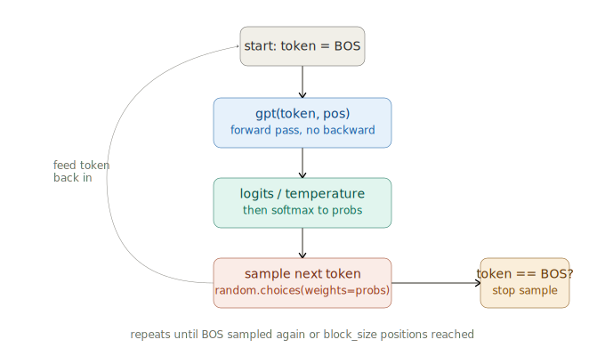
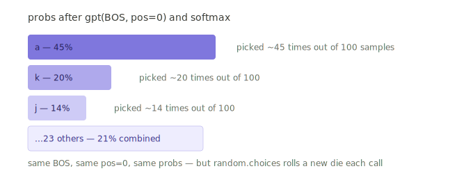

# microgpt — Inference Loop Deep Dive (Sampling, Temperature, Autoregression)

> **Session Date:** June 20, 2026
> **Duration context:** Deep-dive (multi-turn, depth-first)
> **Source:** [Karpathy — microgpt](https://karpathy.github.io/2026/02/12/microgpt/)
> **Tags:** `#microgpt` `#inference` `#sampling` `#temperature` `#autoregression` `#softmax` `#karpathy` `#llm-internals`

---

## Overview

This file captures the **inference loop** portion of the microgpt session — how a trained model generates new, hallucinated names. The key realization: inference reuses the *exact same `gpt()` function* as training, called the same way, but with no targets, no loss, no backward pass. Instead, the model's own sampled output feeds back in as the next input (autoregression).

A large chunk of this section answered a specific, sharp question from the learner: *"For the same BOS token at position 0, do we get a different character every time? And is it like — if `a` appeared as the first character ~45% of the time in training, inference also produces `a` ~45% of the time?"* — **The answer is yes**, and understanding *why* is the core insight of this file.

**Companion file:** `training-notes.md` covers the training loop (forward, loss, backward, Adam).

---

## The Inference Loop — Full Code

```python
temperature = 0.5 # in (0, 1], control the "creativity" of generated text, low to high
print("\n--- inference (new, hallucinated names) ---")
for sample_idx in range(20):
    keys, values = [[] for _ in range(n_layer)], [[] for _ in range(n_layer)]
    token_id = BOS
    sample = []
    for pos_id in range(block_size):
        logits = gpt(token_id, pos_id, keys, values)
        probs = softmax([l / temperature for l in logits])
        token_id = random.choices(range(vocab_size), weights=[p.data for p in probs])[0]
        if token_id == BOS:
            break
        sample.append(uchars[token_id])
    print(f"sample {sample_idx+1:2d}: {''.join(sample)}")
```

---

## Core Concepts

### The autoregressive loop



*Start from BOS → run the model → temperature + softmax → sample a token → feed that token back in as the next input → repeat until BOS is sampled again (or block_size positions reached).*

### What changed from training

It's the **same `gpt()` function**, called the **same way** — that's the elegance of microgpt. But three things differ:

1. **No target, no loss, no backward pass.** Training fed `tokens[pos_id+1]` as a known target and computed how wrong the prediction was. Inference has no "correct answer" — it just takes whatever the model outputs and rolls dice with it.

2. **The token feeds back into itself.** In training the next `token_id` came from the dataset (`tokens[pos_id+1]`, a real letter). In inference the next `token_id` comes from `random.choices(...)` — the model's *own* sampled output becomes the *next* input. This is what **"autoregressive"** means: regress on your own previous outputs.

3. **KV cache resets per sample.** Each of the 20 samples starts fresh: `keys, values = [[] ...]` and `token_id = BOS`, exactly mirroring how each training document started with `[BOS] + ...`.

---

## The Key Question — Is It Different Every Time?

### The forward pass is DETERMINISTIC

`gpt(BOS, 0, keys, values)` produces the **exact same logits** every time, given the trained, frozen parameters. No randomness — it's just matrix math.

```python
logits = gpt(token_id, pos_id, keys, values)            # same input -> same output, always
probs = softmax([l / temperature for l in logits])      # same logits -> same probs, always
```

So if `'a'` got 45% probability after BOS, it gets *exactly* 45% probability after BOS **every single time**, forever, for this trained model. That part is fixed.

### The randomness is ENTIRELY in one line

```python
token_id = random.choices(range(vocab_size), weights=[p.data for p in probs])[0]
```



*`random.choices` is a weighted die roll. Chop a number line 0→1 into 27 segments, each as wide as that token's probability. Pick a uniformly random point — whichever segment it lands in is the sampled token. Different random point each call → different token, even though the segments (probabilities) never change.*

### So where does the 45% come from? (Answering the learner's intuition — YES)

That 45% is **learned, not arbitrary** — and the intuition was exactly right.

During training, **every single document started with `[BOS, first_char, ...]`**. Across ~32,000 names, the model saw thousands of examples of "what comes right after BOS." The cross-entropy loss at `pos_id=0` specifically pushed `p(actual_first_char | BOS)` *up*, every step. If `'a'` is genuinely the most common starting letter (plausible — "amelia", "ava", "anna", "anthony"...), the gradient consistently rewarded the model for putting more probability mass on `'a'`. Over 1000 steps, the parameters settle into values that **reproduce something close to the dataset's true starting-letter frequency distribution.**

> **Generalization (the real insight):** At *every* position, the model has learned the conditional distribution `p(next_char | everything_before_it)` — because that's the *only* thing cross-entropy loss ever optimized for. Position 0 (right after BOS) is just the case where "everything before it" is the empty context.

### Concretely — running inference 100 times from BOS

- ~45 runs sample `'a'` as the first character
- ~20 runs sample `'k'`
- ~14 runs sample `'j'`
- …matching whatever distribution the model learned.

Then for *each* branch, the process repeats. Say you sampled `'a'`. Now `token_id='a'`, `pos_id=1`, and `gpt('a', 1, ...)` produces a *new* deterministic distribution over "what follows 'a' at position 1" — and you roll the die again on *that*. This is why the 20 sample names are all different (`kamon`, `ann`, `karai`, `jaire`...) despite the same trained model: **every character is an independent weighted roll, and the dice compound.**

---

## Temperature — Controlling Creativity

```python
probs = softmax([l / temperature for l in logits])
```

Dividing logits by a number < 1 (here `0.5`) **stretches** the gaps between them before softmax exponentiates. Since softmax is `exp(x)`, larger logit gaps become *much* larger probability gaps — making the top choice more dominant (more conservative).

| temperature | effect |
|-------------|--------|
| → 0 | logits ÷ tiny number → huge gaps → softmax ≈ 100% on the single highest logit → **greedy decoding** (same output every time) |
| 1.0 | no change → sample directly from the model's raw learned distribution |
| → ∞ | logits squashed toward 0 → softmax flattens toward **uniform** → nearly random choice, ignoring what was learned |

`temperature=0.5` (the default in the script) sharpens the distribution — the model is more likely to pick its top choices, producing more "conservative" / plausible names.

---

## Sampling Mechanics

```python
token_id = random.choices(range(vocab_size), weights=[p.data for p in probs])[0]
```

Literally rolling a weighted die with 27 faces, each face weighted by `probs[i].data`. If the model says `p('a') = 0.4`, there's a 40% chance `'a'` gets picked *this specific time* — **not** the highest-probability token automatically.

This is also the literal mechanism behind **"hallucination"**: the model is never asserting a single truth, it's sampling from a learned distribution, and sometimes that distribution puts real weight on a statistically-plausible-but-wrong token. microgpt "hallucinating" the name `karia` is the same phenomenon as ChatGPT confidently stating a false fact.

---

## The Stopping Condition

```python
if token_id == BOS:
    break
```

Recall from training: every document was wrapped `[BOS, ...chars..., BOS]`, so the model was **explicitly trained to predict `BOS` as the correct next token once a name is complete.** At inference, sampling `BOS` is the model saying *"I'm done"* — and the loop honors it by stopping.

If it never samples `BOS`, the `for pos_id in range(block_size)` loop just runs out at `block_size` (16) positions and stops anyway.

---

## How to Verify This Yourself (when running locally)

A great print statement to make the determinism-vs-randomness distinction click:

```python
# right after computing probs at pos_id == 0, before sampling:
if pos_id == 0:
    print({uchars[i]: round(probs[i].data, 4) for i in range(len(uchars))})
```

Print this once per sample (20 times). You'll see the **exact same dictionary every time** (proving the forward pass is deterministic) — while `token_id` after `random.choices` **differs across samples** (proving randomness lives only in the sampling step).

Also worth printing:
```python
print(probs)   # during inference at each position — watch the distribution sharpen as you change temperature
```

---

## The Complete Picture — Full Script Flow

```
Tokenizer → Autograd → Parameters → Architecture →
  Training loop (forward, loss, backward, Adam) →
    Inference (forward only, sample, feed back, repeat)
```

The same `gpt()` forward pass powers both training and inference. The difference is entirely in what wraps around it: training adds targets/loss/backward/Adam; inference adds temperature/sampling/feedback.

---

## Key Takeaways

- **Inference reuses the training `gpt()` function unchanged.** Only the wrapper differs — no loss, no backward, output feeds back as input.
- **The forward pass is fully deterministic.** Same input + frozen params → same logits → same probs, every time. The 45% for `'a'` is fixed once trained.
- **ALL randomness is in `random.choices`** — a weighted die roll over the probability distribution. That's why the same BOS produces different first characters across runs.
- **The learned probabilities mirror the training data's conditional frequencies.** If `'a'` started ~45% of names, the model emits `'a'` first ~45% of the time. At *every* position the model has learned `p(next | context)` — that's literally all cross-entropy optimized.
- **"Autoregressive" = feed your own output back in.** Each character is an independent weighted roll; the dice compound, which is why every generated name differs.
- **Temperature reshapes the distribution before sampling**: → 0 = greedy/deterministic, 1.0 = raw learned distribution, → ∞ = uniform/random.
- **Hallucination is just sampling.** The model emits statistically-plausible completions with no concept of truth — `karia` (microgpt) is mechanically the same as a confident false fact (ChatGPT).
- **BOS doubles as the stop signal**, because training wrapped every document with BOS on both ends.

---

## Open Questions / Next Steps

- Experiment with `temperature` values (0.1, 0.5, 1.0, 1.5) locally and observe how name quality/diversity shifts.
- Fix `random.seed()` to make inference reproducible and confirm the determinism of the forward pass directly.
- Try swapping the dataset (cities, Pokémon, words) — the same code learns whatever conditional distribution is in the data.

---

## References

- [Karpathy — microgpt blog post](https://karpathy.github.io/2026/02/12/microgpt/)
- [microgpt.py gist](https://gist.github.com/karpathy/8627fe009c40f57531cb18360106ce95)
- Companion file: `training-notes.md`
