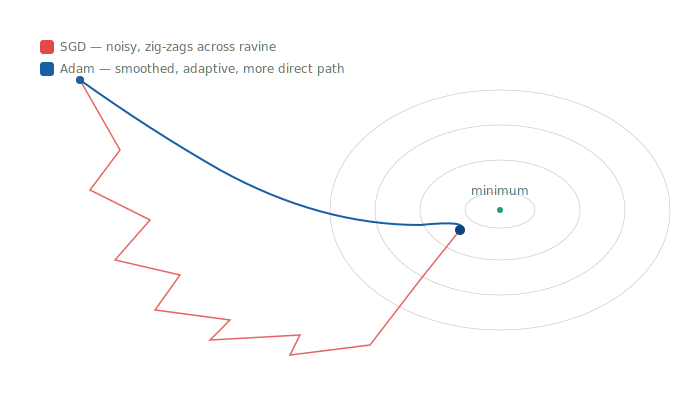
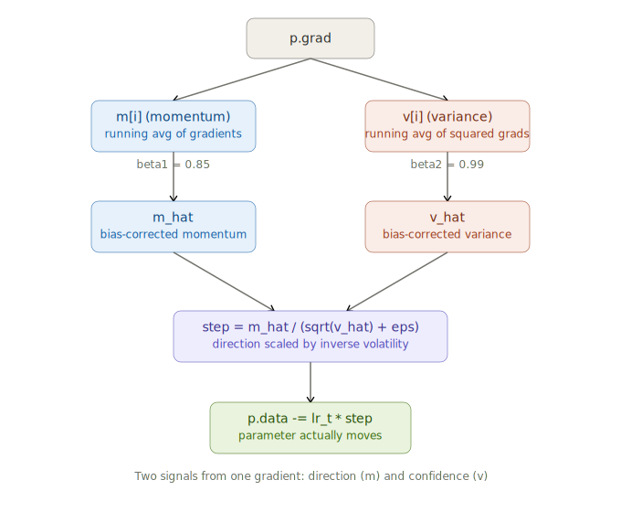
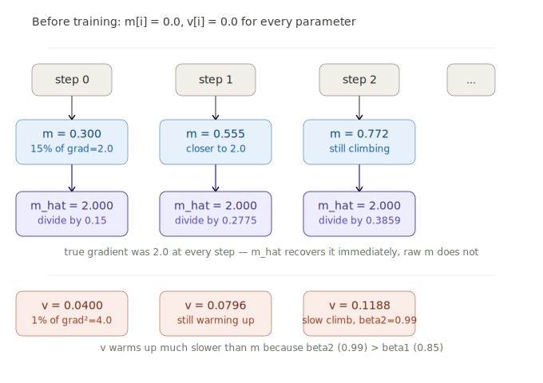
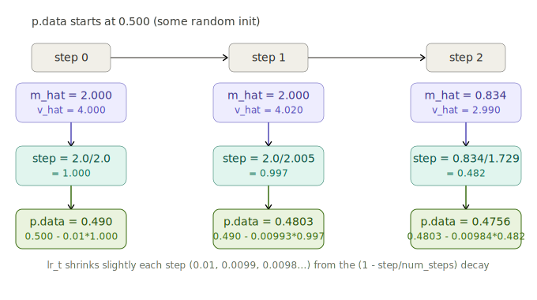
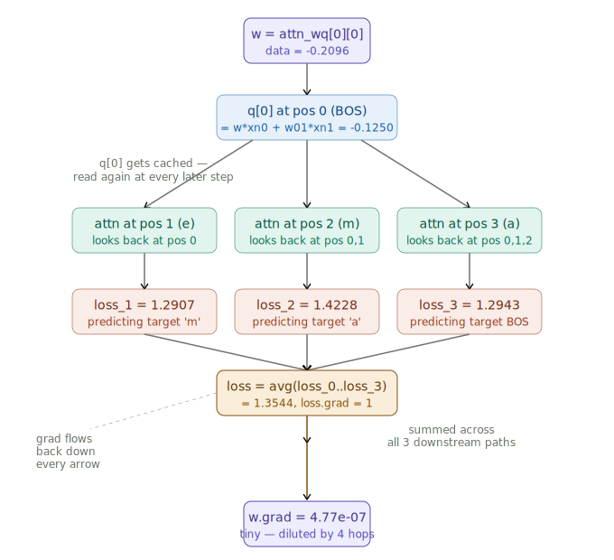

# microgpt — Training Loop Deep Dive (Adam, m/v, Gradients)

> **Session Date:** June 20, 2026
> **Duration context:** Deep-dive (multi-turn, depth-first)
> **Source:** [Karpathy — microgpt](https://karpathy.github.io/2026/02/12/microgpt/)
> **Tags:** `#microgpt` `#adam` `#optimizer` `#backprop` `#training-loop` `#cross-entropy` `#karpathy` `#llm-internals`

---

## Overview

This session dissected the **training loop** of Karpathy's microgpt — the ~200-line pure-Python GPT. We had already covered the autograd engine, the GPT model, and parameters in prior sessions; this one focused entirely on what happens once everything is wired together: forward pass → loss → backward → **Adam optimizer update**.

The bulk of the time went deep on Adam: how `m` (momentum / first moment) and `v` (variance / second moment) are initialized and updated, why bias correction (`m_hat`, `v_hat`) exists, and how the final per-parameter step is computed — all traced with concrete numbers. We finished by tracing where a real `p.grad` value actually comes from, using a shrunk-down but code-identical version of microgpt.

**Companion file:** `inference-notes.md` covers the inference loop (sampling, temperature, autoregression).

---

## The Training Loop — Full Code

```python
# Let there be Adam, the blessed optimizer and its buffers
learning_rate, beta1, beta2, eps_adam = 0.01, 0.85, 0.99, 1e-8
m = [0.0] * len(params) # first moment buffer
v = [0.0] * len(params) # second moment buffer

# Repeat in sequence
num_steps = 1000 # number of training steps
for step in range(num_steps):

    # Take single document, tokenize it, surround it with BOS special token on both sides
    doc = docs[step % len(docs)]
    tokens = [BOS] + [uchars.index(ch) for ch in doc] + [BOS]
    n = min(block_size, len(tokens) - 1)

    # Forward the token sequence through the model, building up the computation graph all the way to the loss.
    keys, values = [[] for _ in range(n_layer)], [[] for _ in range(n_layer)]
    losses = []
    for pos_id in range(n):
        token_id, target_id = tokens[pos_id], tokens[pos_id + 1]
        logits = gpt(token_id, pos_id, keys, values)
        probs = softmax(logits)
        loss_t = -probs[target_id].log()
        losses.append(loss_t)
    loss = (1 / n) * sum(losses) # final average loss over the document sequence

    # Backward the loss, calculating the gradients with respect to all model parameters.
    loss.backward()

    # Adam optimizer update: update the model parameters based on the corresponding gradients.
    lr_t = learning_rate * (1 - step / num_steps) # linear learning rate decay
    for i, p in enumerate(params):
        m[i] = beta1 * m[i] + (1 - beta1) * p.grad
        v[i] = beta2 * v[i] + (1 - beta2) * p.grad ** 2
        m_hat = m[i] / (1 - beta1 ** (step + 1))
        v_hat = v[i] / (1 - beta2 ** (step + 1))
        p.data -= lr_t * m_hat / (v_hat ** 0.5 + eps_adam)
        p.grad = 0

    print(f"step {step+1:4d} / {num_steps:4d} | loss {loss.data:.4f}")
```

---

## Core Concepts

### The 5 phases of one training step

Each iteration of the outer loop does five things in order:

1. **Tokenize** — pick one document, wrap with `BOS` on both sides.
2. **Forward pass + loss** — run the model token-by-token, compute cross-entropy loss at each position, average.
3. **Backward pass** — one `loss.backward()` call fills every parameter's `.grad`.
4. **Adam update** — use those gradients (plus running averages) to nudge every parameter.
5. **Reset** — zero out gradients for the next step.

### Phase 1 — Tokenization

```python
doc = docs[step % len(docs)]
tokens = [BOS] + [uchars.index(ch) for ch in doc] + [BOS]
n = min(block_size, len(tokens) - 1)
```

- `step % len(docs)` cycles through the dataset.
- The name `"emma"` becomes `[BOS, e, m, m, a, BOS]` → `[3, 4, 12, 12, 0, 3]` (illustrative ids).
- **Why BOS on both sides?** The opening BOS signals "a name is starting." The closing BOS is what the model should learn to **predict at the end** — it's how the model learns to *stop*. This is essential for inference termination.
- `n = min(block_size, len(tokens) - 1)` — the `-1` is because every position needs a *next* token as its target. For a 6-token sequence, `n = 5` positions.

### Phase 2 — Forward pass and the prediction window

The inner loop slides a one-token-at-a-time prediction window. For `"emma"`:

| pos_id | token_id (input) | target_id (label) |
|--------|-----------------|-------------------|
| 0 | BOS | e |
| 1 | e | m |
| 2 | m | m |
| 3 | m | a |
| 4 | a | BOS |

This is the **language modeling objective** — pure next-token prediction. The `keys` and `values` KV cache is shared across the inner loop: at `pos_id=3` the attention block can see positions 0,1,2 (causal / left-to-right attention). Crucially, in microgpt these cached K/V are **live `Value` nodes in the computation graph**, so backprop flows through them too (unusual — production hides this inside vectorized attention).

### Phase 2b — Cross-entropy loss

```python
probs = softmax(logits)
loss_t = -probs[target_id].log()
```

`probs[target_id]` is the probability the model assigned to the *correct* next token. Then `-log(p)`:

| Model state | p(correct) | loss = -log(p) |
|-------------|-----------|----------------|
| Confident + correct | ≈ 1.0 | ≈ 0 ✅ |
| Random guess (27 tokens) | ≈ 1/27 ≈ 0.037 | ≈ 3.3 (baseline) |
| Confidently wrong | ≈ 0 | → ∞ 💀 |

This is why loss **starts near 3.3** (`-log(1/27)`) and drops toward **~2.37** as the model learns. `loss = (1/n) * sum(losses)` averages over positions so a 4-letter and 10-letter name contribute equally.

### Phase 3 — Backward pass

```python
loss.backward()
```

One line traverses the entire computation graph (thousands of `Value` nodes) in reverse topological order, accumulating `∂L/∂p` into every parameter's `.grad`. After this call, each `p.grad` answers: *"if I increase this parameter by ε, the loss changes by `p.grad * ε`."*

---

## Adam Optimizer — The Heart of This Session

### Why Adam exists (vs plain SGD)



*SGD with a single global learning rate zig-zags when the loss surface is steep in one direction and shallow in another — it overshoots on the steep axis and crawls on the shallow one. Adam fixes this per-parameter.*

Plain SGD would be `p.data -= lr * p.grad`. It works but is fragile: same learning rate for every parameter, no memory of past gradients. Adam layers **two independent tricks** on top of the raw gradient.

### The full update pipeline



*One gradient produces two signals: direction (`m`) and confidence/volatility (`v`). They're bias-corrected, combined, then applied.*

### What "moment" and "variance" actually mean

In statistics, the **first moment** of a distribution is its **mean**, and the **second moment** relates to its **variance** (spread). Adam borrows this language literally:

- `m` = a running **mean of gradients** → *"where is this parameter's gradient centered, on average?"*
- `v` = a running **mean of squared gradients** → closely related to variance → *"how spread-out / large is this parameter's gradient, ignoring sign?"*

Both are computed via **exponential moving average (EMA)**:

```
new_average = beta * (old_average) + (1 - beta) * (new_observation)
```

A weighted blend: mostly trust history, partially update with the newest data point.

### Initialization

```python
m = [0.0] * len(params)   # every parameter starts with m = 0.0
v = [0.0] * len(params)   # every parameter starts with v = 0.0
```

Every parameter gets **two extra numbers** riding alongside it — `m[i]` and `v[i]` — both starting at exactly `0.0`. These are *memories* the optimizer keeps about that parameter's gradient history across steps. The zero-start is exactly what creates the need for bias correction (below).

---

## Worked Example — Tracing m, v, m_hat, v_hat by hand

We track a **single parameter** with these (made-up but illustrative) gradients over 3 steps. `beta1 = 0.85`, `beta2 = 0.99`.

| step | p.grad |
|------|--------|
| 0 | 2.0 |
| 1 | 2.0 |
| 2 | -1.0 (flips!) |

### Tracing `m` (first moment — mean of gradients)

```
step 0: m = 0.85 * 0.0   + 0.15 * 2.0  = 0.300   # only 15% of true grad — underestimated!
step 1: m = 0.85 * 0.300 + 0.15 * 2.0  = 0.555   # climbing toward 2.0
step 2: m = 0.85 * 0.555 + 0.15 * -1.0 = 0.3218  # DROPS — new grad disagreed with trend
```

The step-2 drop is the **noise-filter behavior**: one contradicting gradient pulls the average down but doesn't erase the two consistent gradients before it. Momentum has memory.

### Tracing `v` (second moment — mean of squared gradients)

```
step 0: v = 0.99 * 0.0    + 0.01 * (2.0)**2  = 0.0400
step 1: v = 0.99 * 0.0400 + 0.01 * (2.0)**2  = 0.0796
step 2: v = 0.99 * 0.0796 + 0.01 * (-1.0)**2 = 0.0888  # barely moves — squaring erases sign
```

**Key insight:** even though the gradient *flipped sign* at step 2 (pulling `m` down), `v` barely moved — because `(-1.0)**2 = +1.0`, a negative gradient still adds *positive* magnitude to `v`. **`v` cares only about magnitude, never direction.**

### m vs v side by side — why v moves slower

| step | m (β=0.85, 15% new info/step) | v (β=0.99, 1% new info/step) |
|------|-------------------------------|-------------------------------|
| 0 | 0.300 | 0.0400 |
| 1 | 0.555 | 0.0796 |
| 2 | 0.3218 | 0.0888 |

`m` reacts fast (tracks direction responsively). `v` reacts slowly (stable long-run estimate of gradient magnitude — you don't want it jumping on a single noisy step).

### Bias correction — what `m_hat`/`v_hat` actually fix



*Both m and v start at zero and are dragged down by that zero for the first several steps. Bias correction scales them back up — maximally at step 0, fading to a no-op once the averages mature.*

The problem: at step 0, `m = (1 - beta1) * grad = 0.15 * grad` — only 15% of the true value, purely because of the zero start, *not* because the gradient was small.

```python
m_hat = m[i] / (1 - beta1 ** (step + 1))
v_hat = v[i] / (1 - beta2 ** (step + 1))
```

Tracing the correction for `m`:

```
step 0: correction = 1 - 0.85**1 = 0.15
        m_hat = 0.300 / 0.15 = 2.000   # exactly recovers the true gradient!

step 1: correction = 1 - 0.85**2 = 0.2775
        m_hat = 0.555 / 0.2775 = 2.000  # still exact (both grads were 2.0)

step 2: correction = 1 - 0.85**3 = 0.3859
        m_hat = 0.3218 / 0.3859 = 0.834  # mixed history now, but unbiased
```

At step 0, `m[0] = (1-beta1)*grad`, so dividing by `(1-beta1)` *always* exactly cancels it on the first step — not a coincidence.

For `v` at step 2: `correction = 1 - 0.99**3 = 0.0297`, so `v_hat = 0.0888 / 0.0297 = 2.990`.

### Why the correction self-disables

`beta1**(step+1)` shrinks toward 0 as steps grow, so `1 - beta1**(step+1)` grows toward 1, so dividing by it does *less and less*:

| step+1 | 1 - 0.85^(step+1) | effect on m_hat |
|--------|-------------------|-----------------|
| 1 | 0.150 | scales m up ~6.7x |
| 5 | 0.556 | scales m up ~1.8x |
| 20 | 0.962 | scales m up ~1.04x |
| 100 | ~1.000 | essentially no correction |

Bias correction is a **self-disabling training-wheel**: maximal work in the first few steps, quietly becomes a no-op once running averages have enough history.

**One-sentence summary:** `m` is "what direction has this parameter's gradient been pointing, smoothed," `v` is "how large has this parameter's gradient been, regardless of direction, smoothed over a longer window," and the hat versions are `m`/`v` with the artificial zero-start penalty mathematically removed.

---

## Worked Example — From m_hat/v_hat to the actual parameter update



*The full chain: m_hat/v_hat → step size → actual p.data change, across three steps. Note how the sign-flip at step 2 halves the step size.*

```python
lr_t = learning_rate * (1 - step / num_steps)
p.data -= lr_t * m_hat / (v_hat ** 0.5 + eps_adam)
```

The combined step is:

```
step = m_hat / (sqrt(v_hat) + eps)
```

- `m_hat` = direction + rough size of the move (smoothed gradient)
- `sqrt(v_hat)` = per-parameter **volatility scale**

Dividing by it means:
- **High-volatility params** (large `v_hat`, steep/noisy) → divided by a large number → **step shrinks** → cautious.
- **Low-volatility params** (small `v_hat`, gentle/consistent) → divided by a small number → **step grows** → confident.

This is exactly what fixes the SGD zig-zag — the steep ravine direction auto-dampens, the shallow direction auto-amplifies, with no hand-tuned per-parameter learning rate.

### Numeric trace (p.data starts at 0.500)

```
STEP 0:
  lr_t = 0.01 * (1 - 0/1000) = 0.01
  step_size = 2.000 / (sqrt(4.000) + 1e-8) = 2.000 / 2.000 = 1.000
  p.data = 0.500 - 0.01 * 1.000 = 0.490

STEP 1:  (m_hat=2.000, v_hat=4.020)
  lr_t = 0.01 * (1 - 1/1000) = 0.00999
  step_size = 2.000 / (sqrt(4.020) + 1e-8) = 2.000 / 2.00499 = 0.99751
  p.data = 0.490 - 0.00999 * 0.99751 = 0.48003

STEP 2:  (gradient flipped to -1.0, so m_hat=0.834, v_hat=2.990)
  lr_t = 0.01 * (1 - 2/1000) = 0.00998
  step_size = 0.834 / (sqrt(2.990) + 1e-8) = 0.834 / 1.7292 = 0.4823
  p.data = 0.48003 - 0.00998 * 0.4823 = 0.47522
```

**Two huge observations:**

1. **At step 0, even though raw gradient was `2.0`, the actual subtracted amount is `lr_t * 1.000 = 0.01`.** Division by `sqrt(v_hat)` *normalized away the magnitude of the gradient.* What remains is essentially "move 1 unit of step-size in the gradient's direction, scaled only by `lr`." This normalization (large OR small gradients → similarly-scaled step) is the whole point.

2. **At step 2, the gradient flipped sign and the step size dropped from ~1.0 to ~0.48 (roughly half).** `m_hat` shrank because the new gradient disagreed with the trend, so the update became more cautious. Adam doesn't whiplash on a single contradicting gradient the way SGD would.

### Stabilization table (consistent gradient = 2.0 every step)

| step | p.grad | m (raw) | m_hat | v (raw) | v_hat | step ≈ m_hat/√v_hat |
|------|--------|---------|-------|---------|-------|----------------------|
| 0 | 2.0 | 0.300 | 2.000 | 0.040 | 4.000 | 1.000 |
| 1 | 2.0 | 0.555 | 2.000 | 0.0796 | 4.020 | 0.997 |
| 2 | 2.0 | 0.7718 | 2.000 | 0.1188 | 4.027 | 0.997 |

`m_hat` snaps to the true gradient `2.0` almost immediately (bias correction), and the effective step size stabilizes near `1.0` regardless of the raw gradient's literal magnitude.

### Two separate mechanisms — don't conflate them

- **Adam's `sqrt(v_hat)` division** adapts *relative* step sizes *between* parameters.
- **`lr_t` linear decay** (`0.01 → 0.0`) shrinks the *overall* step size *as training progresses* (big confident leaps early, gentle fine-tuning late).

### `p.grad = 0`

Resets gradient for the next step — **necessary** because the autograd `Value` class accumulates gradients with `+=` (the multivariable chain rule). Skip this and gradients from previous steps bleed into the current one.

---

## Worked Example — Where Does `p.grad` Actually Come From?

The earlier `p.grad = 2.0` was a round stand-in. Real gradients fall out of `loss.backward()` walking the chain rule. To make this concrete, we ran a **shrunk but code-identical** microgpt: `n_embd=2`, `n_head=1`, vocab `{e, m, a, BOS}`, one real forward+backward pass on `"ema"`.

```
tokens: [BOS, e, m, a, BOS]  ->  [3, 0, 1, 2, 3]

pos 0: token=BOS  target=e    loss=1.4095
pos 1: token=e    target=m    loss=1.2907
pos 2: token=m    target=a    loss=1.4228
pos 3: token=a    target=BOS  loss=1.2943
total loss = 1.3544

Target parameter: layer0.attn_wq[0][0]
  w.data = -0.2096
  w.grad = 4.77e-07   <- REAL gradient, tiny
```

### Forward path of `w = attn_wq[0][0]`

`linear` is `sum(wi * xi for wi, xi in zip(wo, x))` per row — so `w` (row 0, col 0) only ever touches `q[0]`, never `q[1]`. Captured intermediates at position 0:

```
xn (after rmsnorm) = [0.8569, -1.1250]
attn_wq row 0       = [-0.2096, -0.0486]
q[0] = -0.2096 * 0.8569 + (-0.0486) * (-1.1250) = -0.1250
```

### Why this gradient is so tiny (4.77e-07)



*The weight's influence on the loss must travel through rmsnorm, softmax, an MLP/ReLU, and the output softmax+cross-entropy — each multiplying in its own local gradient (often < 1). Chaining 5–6 of these compounds into heavy shrinkage.*

The signal got diluted by the chain rule's product of many small local derivatives — the same phenomenon as the classic **vanishing gradient** problem in deep networks. (This is also *why residual connections exist* — to give gradient a shortcut path that bypasses some of that multiplicative shrinkage.)

Compare: a parameter close to the loss (like `lm_head`) gets a comfortable `~1–3` gradient; a parameter buried layers/positions deep (like this `attn_wq[0][0]`) gets `~1e-7`.

### The general principle

Every parameter's gradient is the same chain-rule product:

> **how surprised the model was** (softmax probability error) **×** **the value flowing through that exact connection** (the local activation)

…just with a longer or shorter path. Parameters reused multiple times in one forward pass (e.g. `wte` for a repeated letter) get their gradients **summed** across those uses (the `+=` accumulation rule in `backward()`).

---

## Mini microgpt — Full Runnable Script (used for the gradient trace)

```python
import math, random

class Value:
    __slots__ = ('data', 'grad', '_children', '_local_grads', '_label')
    def __init__(self, data, children=(), local_grads=(), label=''):
        self.data = data
        self.grad = 0
        self._children = children
        self._local_grads = local_grads
        self._label = label
    def __add__(self, other):
        other = other if isinstance(other, Value) else Value(other)
        return Value(self.data + other.data, (self, other), (1, 1))
    def __mul__(self, other):
        other = other if isinstance(other, Value) else Value(other)
        return Value(self.data * other.data, (self, other), (other.data, self.data))
    def __pow__(self, other): return Value(self.data**other, (self,), (other * self.data**(other-1),))
    def log(self): return Value(math.log(self.data), (self,), (1/self.data,))
    def exp(self): return Value(math.exp(self.data), (self,), (math.exp(self.data),))
    def relu(self): return Value(max(0, self.data), (self,), (float(self.data > 0),))
    def __neg__(self): return self * -1
    def __radd__(self, other): return self + other
    def __sub__(self, other): return self + (-other)
    def __rsub__(self, other): return other + (-self)
    def __rmul__(self, other): return self * other
    def __truediv__(self, other): return self * other**-1
    def __rtruediv__(self, other): return other * self**-1
    def backward(self):
        topo, visited = [], set()
        def build_topo(v):
            if v not in visited:
                visited.add(v)
                for child in v._children:
                    build_topo(child)
                topo.append(v)
        build_topo(self)
        self.grad = 1
        for v in reversed(topo):
            for child, local_grad in zip(v._children, v._local_grads):
                child.grad += local_grad * v.grad

random.seed(42)
n_embd, n_head, head_dim, block_size = 2, 1, 2, 8
uchars = ['e','m','a']
BOS = len(uchars)            # 3
vocab_size = len(uchars) + 1 # 4

def matrix(nout, nin, std=0.08, prefix=""):
    return [[Value(random.gauss(0, std), label=f"{prefix}[{r}][{c}]") for c in range(nin)] for r in range(nout)]

state_dict = {
    'wte': matrix(vocab_size, n_embd, prefix="wte"),
    'wpe': matrix(block_size, n_embd, prefix="wpe"),
    'lm_head': matrix(vocab_size, n_embd, prefix="lm_head"),
}
state_dict['layer0.attn_wq'] = matrix(n_embd, n_embd, prefix="attn_wq")
state_dict['layer0.attn_wk'] = matrix(n_embd, n_embd, prefix="attn_wk")
state_dict['layer0.attn_wv'] = matrix(n_embd, n_embd, prefix="attn_wv")
state_dict['layer0.attn_wo'] = matrix(n_embd, n_embd, prefix="attn_wo")
state_dict['layer0.mlp_fc1'] = matrix(4*n_embd, n_embd, prefix="mlp_fc1")
state_dict['layer0.mlp_fc2'] = matrix(n_embd, 4*n_embd, prefix="mlp_fc2")
params = [p for mat in state_dict.values() for row in mat for p in row]

def linear(x, w):
    return [sum(wi * xi for wi, xi in zip(wo, x)) for wo in w]

def softmax(logits):
    max_val = max(val.data for val in logits)
    exps = [(val - max_val).exp() for val in logits]
    total = sum(exps)
    return [e / total for e in exps]

def rmsnorm(x):
    ms = sum(xi * xi for xi in x) / len(x)
    scale = (ms + 1e-5) ** -0.5
    return [xi * scale for xi in x]

def gpt(token_id, pos_id, keys, values, n_layer=1):
    tok_emb = state_dict['wte'][token_id]
    pos_emb = state_dict['wpe'][pos_id]
    x = [t + p for t, p in zip(tok_emb, pos_emb)]
    x = rmsnorm(x)
    for li in range(n_layer):
        x_residual = x
        x = rmsnorm(x)
        q = linear(x, state_dict[f'layer{li}.attn_wq'])
        k = linear(x, state_dict[f'layer{li}.attn_wk'])
        v = linear(x, state_dict[f'layer{li}.attn_wv'])
        keys[li].append(k)
        values[li].append(v)
        x_attn = []
        for h in range(n_head):
            hs = h * head_dim
            q_h = q[hs:hs+head_dim]
            k_h = [ki[hs:hs+head_dim] for ki in keys[li]]
            v_h = [vi[hs:hs+head_dim] for vi in values[li]]
            attn_logits = [sum(q_h[j] * k_h[t][j] for j in range(head_dim)) / head_dim**0.5 for t in range(len(k_h))]
            attn_weights = softmax(attn_logits)
            head_out = [sum(attn_weights[t] * v_h[t][j] for t in range(len(v_h))) for j in range(head_dim)]
            x_attn.extend(head_out)
        x = linear(x_attn, state_dict[f'layer{li}.attn_wo'])
        x = [a + b for a, b in zip(x, x_residual)]
        x_residual = x
        x = rmsnorm(x)
        x = linear(x, state_dict[f'layer{li}.mlp_fc1'])
        x = [xi.relu() for xi in x]
        x = linear(x, state_dict[f'layer{li}.mlp_fc2'])
        x = [a + b for a, b in zip(x, x_residual)]
    logits = linear(x, state_dict['lm_head'])
    return logits

# one training step on "ema"
doc = "ema"
tokens = [BOS] + [uchars.index(ch) for ch in doc] + [BOS]
n = min(block_size, len(tokens) - 1)
keys, values = [[] for _ in range(1)], [[] for _ in range(1)]
losses = []
for pos_id in range(n):
    token_id, target_id = tokens[pos_id], tokens[pos_id+1]
    logits = gpt(token_id, pos_id, keys, values)
    probs = softmax(logits)
    loss_t = -probs[target_id].log()
    losses.append(loss_t)
loss = (1/n) * sum(losses)
loss.backward()

w = state_dict['layer0.attn_wq'][0][0]
print("w.data =", w.data, " w.grad =", w.grad)
```

---

## The Big Picture

```
[Data] → Tokenize → [Forward: build computation graph]
                            ↓
                       [Loss: how wrong?]
                            ↓
                  [Backward: how wrong for each param?]
                            ↓
                  [Adam: nudge params toward less wrong]
                            ↓
                       [Repeat 1000x]
```

Loss trajectory: **~3.3** (`-log(1/27)`, random) → **~2.37** (learned structure: "names rarely have 3 consonants in a row," "after qu comes a vowel," etc.).

---

## Key Takeaways

- **`m` and `v` are per-parameter memories**, both initialized to `0.0`, updated via exponential moving average every step. `m` = smoothed gradient direction; `v` = smoothed gradient magnitude (sign-blind).
- **`beta1=0.85` makes `m` fast-moving** (15% new info/step); **`beta2=0.99` makes `v` slow-moving** (1% new info/step). This asymmetry is intentional: direction should respond quickly, the volatility estimate should be stable.
- **Bias correction is a self-disabling training-wheel** — it exactly cancels the zero-initialization penalty at step 0 and fades to a no-op as the averages mature.
- **Dividing by `sqrt(v_hat)` normalizes away raw gradient magnitude** — large and small gradients both converge to similarly-scaled steps (~1.0). This is what kills the SGD zig-zag without per-parameter LR tuning.
- **Adam's adaptivity (between params) and `lr_t` decay (overall, over time) are separate mechanisms.** Don't conflate them.
- **A sign-flip in the gradient halves the step size** because `m_hat` shrinks while `v` stays high — Adam is naturally cautious when the signal becomes inconsistent.
- **Real gradients range from ~1–3 (near the loss, e.g. `lm_head`) down to ~1e-7 (buried deep, e.g. `attn_wq[0][0]`)** due to multiplicative shrinkage through the chain rule — the vanishing-gradient phenomenon, and the reason residual connections exist.
- **`p.grad = 0` is mandatory** because the autograd engine accumulates with `+=`.

---

## Open Questions / Next Steps

- The chosen `beta1=0.85 / beta2=0.99` are *non-default* (PyTorch defaults are `0.9 / 0.999`) — worth exploring why Karpathy picked faster-decaying values for this tiny/short run.
- Tracing a parameter *close* to the loss (`lm_head`) to directly compare gradient magnitude vs the deep `attn_wq` one.
- **Plan:** train microgpt locally and print real variables to internalize all of this — see the "things worth printing" list below.

### Things worth printing when running locally

```python
# right after loss.backward(), first ~10 steps:
print(params[0].grad, params[100].grad)        # watch gradients settle

# inside the param loop, for one parameter i, alongside step:
print(step, m[i], v[i], m_hat, v_hat)           # watch bias-correction warmup live
```

---

## References

- [Karpathy — microgpt blog post](https://karpathy.github.io/2026/02/12/microgpt/)
- [microgpt.py gist](https://gist.github.com/karpathy/8627fe009c40f57531cb18360106ce95)
- [build_microgpt.py progression gist](https://gist.github.com/karpathy/561ac2de12a47cc06a23691e1be9543a)
- [micrograd video (2.5h)](https://www.youtube.com/watch?v=VMj-3S1tku0)
- Companion file: `inference-notes.md`
