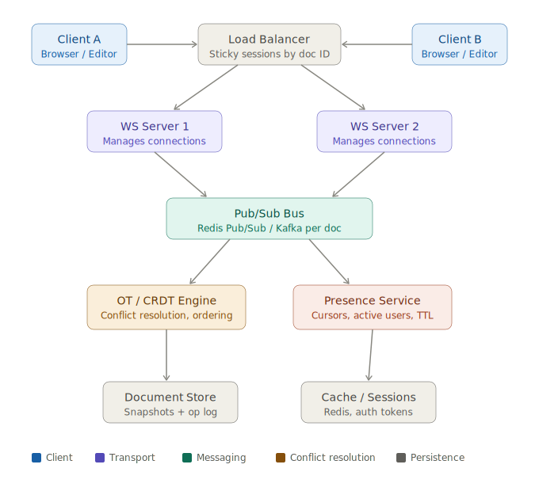

# Real-time collaborative text editor — system design

A complete breakdown of how to design a Google Docs–style collaborative editor: architecture, conflict resolution, and presence.

---

## Table of contents

1. [The core challenge](#the-core-challenge)
2. [System architecture](#system-architecture)
3. [What is an "op"?](#what-is-an-op)
4. [OT vs CRDT — conflict resolution](#ot-vs-crdt--conflict-resolution)
5. [Presence — cursors and awareness](#presence--cursors-and-awareness)
6. [Persistence — snapshots and op log](#persistence--snapshots-and-op-log)
7. [Scaling considerations](#scaling-considerations)

---

## The core challenge

The hard part of a real-time editor isn't "real-time" — WebSockets solve the transport layer. The hard part is **conflict resolution**: what happens when two users edit the same position simultaneously?

Two dominant approaches exist:

- **Operational Transformation (OT)** — transform operations against concurrent operations before applying them. Used by Google Docs. Complex to implement correctly but battle-tested.
- **CRDTs (Conflict-free Replicated Data Types)** — data structures that commute by design, so order doesn't matter. Used by Figma, Linear, Notion. Easier to reason about, better suited to distributed systems.

---

## System architecture



### Key architectural decisions

**Sticky sessions on the load balancer** — route all connections for a given document to the same WebSocket server by hashing on `doc_id`. This avoids cross-server fan-out for every operation.

**Pub/Sub for multi-server broadcast** — when a WS server receives an op, it publishes to a per-document Redis channel. Every other WS server subscribed to that channel relays it to their connected clients.

**Presence as a separate path** — presence messages (cursors, awareness) never touch the OT engine or op log. They are a completely separate processing path with their own Redis store and TTL logic.

---

## What is an "op"?

**Op** = operation. A structured description of a *change* to the document, rather than sending the full document state.

Instead of sending the whole document on every keystroke, you send only what changed:

```json
{ "type": "insert", "position": 5, "text": " World" }
```

### The three op types

Every text editor only needs three operations:

| Op | Meaning |
|---|---|
| `INSERT` | Insert text X at position P |
| `DELETE` | Delete N characters starting at position P |
| `RETAIN` | Keep the next N characters unchanged (used in some formats) |

### The conflict problem

```
Starting document:  "Hello"
                     01234     ← position index

User A: insert " World" at position 5  →  "Hello World"
User B: insert "!" at position 5       →  "Hello!"

Both sent concurrently. Server receives A first, then B.
```

After applying A's op, the doc is `"Hello World"`. Now B's op arrives: `insert "!" at position 5`. Applied naively:

```
"Hello World"
     ^ position 5

Result: "Hello! World"   ← WRONG
```

The correct result should be `"Hello World!"`. This is the fundamental problem both OT and CRDT solve.

---

## OT vs CRDT — conflict resolution

### How Operational Transformation (OT) solves it

OT transforms the position of a late-arriving op against ops that came in before it.

```python
def transform_insert(op, concurrent_op):
    # If concurrent op inserted before our position, shift right
    if concurrent_op.type == "insert" and concurrent_op.pos <= op.pos:
        return Insert(op.pos + len(concurrent_op.text), op.text)
    return op
```

B's op arrives: `insert "!" at pos 5, rev 0`. The server transforms it:
- A inserted 6 chars at pos 5, which is ≤ B's pos 5
- Shift B's position: `5 + 6 = 11`
- Apply `insert "!" at pos 11` to `"Hello World"` → `"Hello World!"` ✓

<svg width="100%" viewBox="0 0 680 380" role="img" xmlns="http://www.w3.org/2000/svg">
  <title>End-to-end flow of a single edit operation</title>
  <desc>Five steps from user keystroke to all clients converging</desc>
  <defs>
    <marker id="arrow2" viewBox="0 0 10 10" refX="8" refY="5" markerWidth="6" markerHeight="6" orient="auto-start-reverse">
      <path d="M2 1L8 5L2 9" fill="none" stroke="#888780" stroke-width="1.5" stroke-linecap="round" stroke-linejoin="round"/>
    </marker>
  </defs>

  <rect x="40" y="30" width="600" height="48" rx="8" fill="#E6F1FB" stroke="#185FA5" stroke-width="0.5"/>
  <text font-size="14" font-weight="500" x="120" y="49" dominant-baseline="central" fill="#0C447C">1. User types</text>
  <text font-size="12" x="120" y="67" dominant-baseline="central" fill="#185FA5">Op applied locally (optimistic). Editor feels instant.</text>
  <line x1="340" y1="78" x2="340" y2="102" stroke="#888780" stroke-width="1.5" marker-end="url(#arrow2)"/>

  <rect x="40" y="104" width="600" height="48" rx="8" fill="#EEEDFE" stroke="#534AB7" stroke-width="0.5"/>
  <text font-size="14" font-weight="500" x="120" y="122" dominant-baseline="central" fill="#3C3489">2. Op sent to WS server</text>
  <text font-size="12" x="120" y="140" dominant-baseline="central" fill="#534AB7">{ type: insert, pos: 42, text: "a", rev: 17, clientId: "u1" }</text>
  <line x1="340" y1="152" x2="340" y2="176" stroke="#888780" stroke-width="1.5" marker-end="url(#arrow2)"/>

  <rect x="40" y="178" width="600" height="48" rx="8" fill="#FAEEDA" stroke="#854F0B" stroke-width="0.5"/>
  <text font-size="14" font-weight="500" x="120" y="196" dominant-baseline="central" fill="#633806">3. Server transforms and sequences</text>
  <text font-size="12" x="120" y="214" dominant-baseline="central" fill="#854F0B">Transforms against concurrent ops, assigns global revision rev: 18</text>
  <line x1="340" y1="226" x2="340" y2="250" stroke="#888780" stroke-width="1.5" marker-end="url(#arrow2)"/>

  <rect x="40" y="252" width="600" height="48" rx="8" fill="#E1F5EE" stroke="#0F6E56" stroke-width="0.5"/>
  <text font-size="14" font-weight="500" x="120" y="270" dominant-baseline="central" fill="#085041">4. Broadcast via Pub/Sub</text>
  <text font-size="12" x="120" y="288" dominant-baseline="central" fill="#0F6E56">Published to doc channel → all WS servers → all connected clients</text>
  <line x1="340" y1="300" x2="340" y2="324" stroke="#888780" stroke-width="1.5" marker-end="url(#arrow2)"/>

  <rect x="40" y="326" width="600" height="44" rx="8" fill="#F1EFE8" stroke="#5F5E5A" stroke-width="0.5"/>
  <text font-size="14" font-weight="500" x="120" y="344" dominant-baseline="central" fill="#444441">5. Clients reconcile</text>
  <text font-size="12" x="120" y="360" dominant-baseline="central" fill="#5F5E5A">Originator acknowledges; others apply transformed op to their local state</text>
</svg>

### How CRDT solves it differently

CRDT changes the data model. Instead of referencing positions (mutable integers that shift), each character gets a **globally unique ID**. Operations reference stable IDs.

```
OT op:   { insert: " World", position: 5 }          ← position can shift
CRDT op: { insert: " World", after: "root·4" }      ← ID never shifts
```

When two ops both say "insert after `root·4`", they become siblings in the document tree. A deterministic tie-breaking rule (e.g. compare client IDs lexicographically) decides their order — consistently on every client, without a coordinator.

### OT vs CRDT — when to use which

| | OT | CRDT |
|---|---|---|
| Conflict resolution | Server transforms positions | Stable IDs, deterministic merge |
| Needs central server | Yes (coordinator required) | No (peer-to-peer capable) |
| Offline support | Hard | Native |
| Semantic correctness | Higher (server controls intent) | Lower (tie-breaking is mechanical) |
| Implementation complexity | High (transform functions are subtle) | Low (use Yjs or Automerge) |
| Used by | Google Docs | Figma, Linear, Notion |

**Practical recommendation:** For most new projects, use [Yjs](https://github.com/yjs/yjs) — a mature CRDT library with WebSocket provider, awareness protocol, and bindings for ProseMirror, CodeMirror, and Quill. Don't hand-roll OT.

---

## Presence — cursors and awareness

**Presence** = everything about *who is here and what they're doing* — not the document content itself.

This includes cursor position, text selection, user identity (name, avatar, colour), typing indicators, and active/idle/disconnected status.

### Why presence is different from ops

| Property | Document ops | Presence |
|---|---|---|
| Persistence | Must be stored forever | Ephemeral — discard after use |
| Frequency | ~1–5/sec per user | Up to 60/sec per user |
| Loss tolerance | Zero — every op matters | High — next update arrives in ms |
| Processing | Through OT/CRDT engine | Bypass engine entirely |

### The full presence pipeline

<svg width="100%" viewBox="0 0 680 420" role="img" xmlns="http://www.w3.org/2000/svg">
  <title>Presence message pipeline from client to all connected users</title>
  <desc>Six stages: user moves cursor, throttle, WS send, Redis store with TTL, pub/sub broadcast, client renders cursor</desc>
  <defs>
    <marker id="arrow3" viewBox="0 0 10 10" refX="8" refY="5" markerWidth="6" markerHeight="6" orient="auto-start-reverse">
      <path d="M2 1L8 5L2 9" fill="none" stroke="#888780" stroke-width="1.5" stroke-linecap="round" stroke-linejoin="round"/>
    </marker>
  </defs>

  <rect x="40" y="30" width="600" height="48" rx="8" fill="#EEEDFE" stroke="#534AB7" stroke-width="0.5"/>
  <text font-size="14" font-weight="500" x="120" y="49" dominant-baseline="central" fill="#3C3489">1. User moves cursor</text>
  <text font-size="12" x="120" y="67" dominant-baseline="central" fill="#534AB7">Cursor is now at character offset 42 in the document</text>
  <line x1="340" y1="78" x2="340" y2="102" stroke="#888780" stroke-width="1.5" marker-end="url(#arrow3)"/>

  <rect x="40" y="104" width="600" height="48" rx="8" fill="#FAEEDA" stroke="#854F0B" stroke-width="0.5"/>
  <text font-size="14" font-weight="500" x="120" y="122" dominant-baseline="central" fill="#633806">2. Client throttles (50ms)</text>
  <text font-size="12" x="120" y="140" dominant-baseline="central" fill="#854F0B">Not every keystroke fires a network message — debounced to ~20 updates/sec max</text>
  <line x1="340" y1="152" x2="340" y2="176" stroke="#888780" stroke-width="1.5" marker-end="url(#arrow3)"/>

  <rect x="40" y="178" width="600" height="48" rx="8" fill="#E1F5EE" stroke="#0F6E56" stroke-width="0.5"/>
  <text font-size="14" font-weight="500" x="120" y="196" dominant-baseline="central" fill="#085041">3. Presence message sent (same WS, different type)</text>
  <text font-size="12" x="120" y="214" dominant-baseline="central" fill="#0F6E56">{ type: "presence", userId: "u1", cursor: 42, rev: 17, ts: ... }</text>
  <line x1="340" y1="226" x2="340" y2="250" stroke="#888780" stroke-width="1.5" marker-end="url(#arrow3)"/>

  <rect x="40" y="252" width="600" height="48" rx="8" fill="#F1EFE8" stroke="#5F5E5A" stroke-width="0.5"/>
  <text font-size="14" font-weight="500" x="120" y="270" dominant-baseline="central" fill="#444441">4. Server stores in Redis with TTL</text>
  <text font-size="12" x="120" y="288" dominant-baseline="central" fill="#5F5E5A">HSET presence:doc_1 u1 {...}  |  EXPIRE presence:doc_1:u1 5</text>
  <line x1="340" y1="300" x2="340" y2="324" stroke="#888780" stroke-width="1.5" marker-end="url(#arrow3)"/>

  <rect x="40" y="326" width="600" height="48" rx="8" fill="#E1F5EE" stroke="#0F6E56" stroke-width="0.5"/>
  <text font-size="14" font-weight="500" x="120" y="344" dominant-baseline="central" fill="#085041">5. Broadcast to all other clients in doc</text>
  <text font-size="12" x="120" y="362" dominant-baseline="central" fill="#0F6E56">Published to presence:doc_1 channel — NOT through the op engine</text>
  <line x1="340" y1="374" x2="340" y2="396" stroke="#888780" stroke-width="1.5" marker-end="url(#arrow3)"/>

  <rect x="40" y="398" width="600" height="14" rx="4" fill="#EEEDFE" stroke="#534AB7" stroke-width="0.5"/>
  <text font-size="11" x="340" y="405" text-anchor="middle" dominant-baseline="central" fill="#534AB7">6. Other clients render cursor at computed pixel position</text>
</svg>

### The presence payload

```json
{
  "type":      "presence",
  "docId":     "doc_abc123",
  "userId":    "u1",
  "name":      "Abhishek",
  "color":     "#7F77DD",
  "cursor":    42,
  "selection": { "from": 38, "to": 42 },
  "rev":       17,
  "ts":        1716723455821
}
```

**Why `rev` matters:** If you receive a cursor at offset 42 from rev 17, but you're on rev 19, you must transform that position through the 2 ops applied since rev 17. Without `rev`, remote cursors jump to wrong positions whenever anyone types.

**Never send pixel coordinates.** Each client computes its own pixel position from the character offset using the browser's layout engine (`getBoundingClientRect`). Screen coords are meaningless to other clients with different window sizes or zoom levels.

### Ghost cursor cleanup — TTL

When a user's tab crashes or their network drops, they don't send a "goodbye" message. Without cleanup, their cursor stays on screen forever.

```
Client → sends presence heartbeat every 2–3 seconds (even when idle)
Server → EXPIRE presence:doc_1:u1 5    (reset on every ping)
         If no ping for 5 seconds → Redis auto-deletes the key
         → Redis keyspace notification fires
         → Server broadcasts { type: "presence_leave", userId: "u1" }
         → All clients remove that user's cursor
```

TTL tradeoff: shorter TTL = faster ghost cleanup, but more false "disconnected" flashes on shaky networks. Typical values: 3–10 seconds.

### How cursors are rendered

```
Receive: { cursor: 42 }

Step 1: Find the DOM text node at character offset 42
        (ProseMirror, CodeMirror, Quill all expose this)

Step 2: range.getBoundingClientRect()
        → get exact x, y, height in pixels

Step 3: Position a 2px wide absolutely-placed div at those coords
        above the text layer, coloured per user

Step 4: On every local edit → recalculate all remote cursor
        positions (layout may have reflowed)
```

Add a CSS transition on cursor movement:

```css
.remote-cursor {
  position: absolute;
  width: 2px;
  border-radius: 1px;
  transition: left 150ms ease, top 150ms ease;
}
```

Without the transition, remote cursors teleport jarringly on every update. The 150ms ease makes them feel like they're moved by a hand, not a network packet.

### How real products handle presence

| Product | Approach |
|---|---|
| Google Docs | Dedicated presence channel separate from doc sync, 30s keepalives, cursors anchored to doc nodes not raw offsets |
| Figma | In-memory presence store per "room" on relay servers, sub-second cleanup |
| Notion | Yjs awareness protocol — presence, cursors, and TTL as first-class CRDT features |

For new projects, [`y-protocols/awareness`](https://github.com/yjs/y-protocols) (part of the Yjs ecosystem) gives you the entire presence protocol in ~50 lines of integration code.

---

## Persistence — snapshots and op log

You can't store every keystroke forever, but you need to reconstruct document state at any point.

```
op_log:    [op1, op2, op3, ... op5000, op5001, ...]
snapshots: { rev: 5000 → full_doc_state }
```

On document load:
1. Fetch the latest snapshot
2. Replay ops from that snapshot's revision to the current revision
3. Periodically compact: snapshot current state, prune old ops

This also gives you **version history** for free.

---

## Scaling considerations

| Problem | Solution |
|---|---|
| Multiple WS servers need to share ops | Redis Pub/Sub per `doc_id` |
| Hot documents (viral shared docs) | Horizontal WS server scaling + consistent hashing |
| Client reconnection | Client tracks last seen `rev`; server sends delta from that rev |
| Offline support | CRDT (Yjs) handles natively; merge on reconnect |
| Large documents | Lazy loading by viewport + chunked op history |
| Presence at scale | Separate presence service with its own Redis cluster |

---

## Quick reference — message types

```
WebSocket message types (same connection, different paths):

type: "op"           → goes through OT/CRDT engine → op log → broadcast
type: "presence"     → goes to Redis with TTL → broadcast (bypasses engine)
type: "presence_leave" → sent by server on TTL expiry → clients remove cursor
type: "sync"         → client requests delta from rev N → server replays ops
type: "ack"          → server confirms op applied at revision N
```

---

*Notes compiled from a system design discussion covering architecture, operational transformation, CRDTs, and presence systems.*
