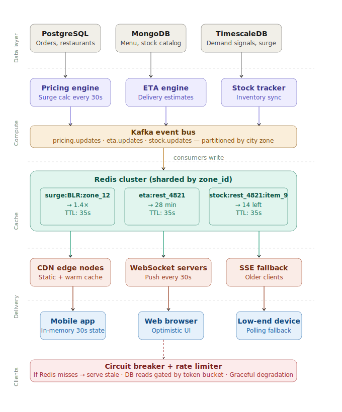
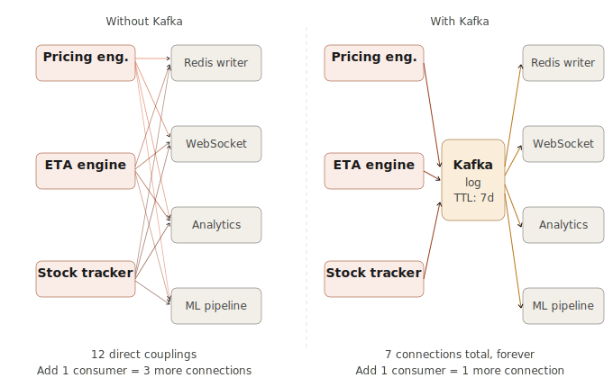
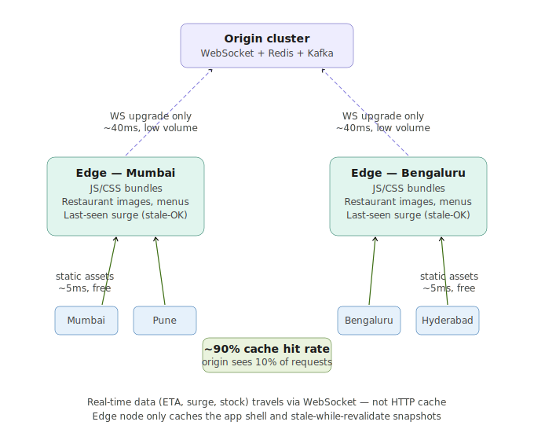
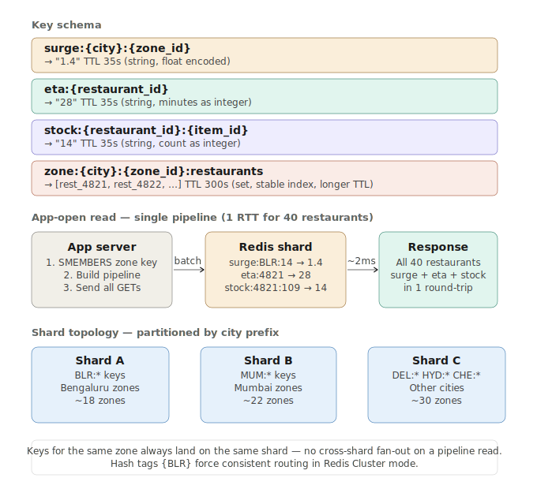
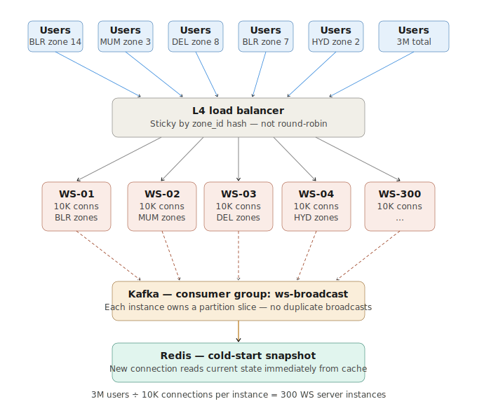

# System Design: Swiggy at IPL Scale

> **Scenario**: 3 million users open Swiggy simultaneously during the IPL finals. Every restaurant within 5km gets hit at once. Swiggy must serve real-time delivery estimates, live stock availability, and surge pricing — all changing every 30 seconds — without the database collapsing under 3 million reads every 30 seconds.

---

## Table of Contents

1. [Full System Architecture](#1-full-system-architecture)
2. [Why Kafka as the Event Backbone](#2-why-kafka-as-the-event-backbone)
3. [How CDN Edge Nodes Help with Real-Time Data](#3-how-cdn-edge-nodes-help-with-real-time-data)
4. [Redis Zone-Based Caching Structure](#4-redis-zone-based-caching-structure)
5. [Scaling WebSockets to Millions of Connections](#5-scaling-websockets-to-millions-of-connections)

---

## 1. Full System Architecture

### The core problem reframed

3M users × 3 data types × every 30s = **270,000 reads/second** if you're naive. Your Postgres dies instantly. The entire solution is: **compute once, cache aggressively, push don't pull.**



### Layer 1 — The 30-second compute cycle

Each compute engine runs on a **cron/event loop every 30s**, not per-user:

- **Pricing engine** reads demand signals from TimescaleDB (order velocity per zone), calculates surge multiplier (1.0× → 2.4×), and emits `pricing.updated` event.
- **ETA engine** aggregates active delivery partner positions + restaurant prep times + zone traffic. Computes ETAs per restaurant, emits `eta.updated`.
- **Stock tracker** gets inventory diffs from restaurant POS integrations, emits `stock.updated`.

**Key insight**: The output of all three is O(restaurants × zones) — maybe 50K keys total for Bengaluru. Not O(users).

### Layer 2 — Kafka as the nervous system

All three engines publish to **partitioned Kafka topics** (`pricing.updates`, `eta.updates`, `stock.updates`), partitioned by `city_zone_id`. This gives you:

- **Decoupling**: downstream consumers can scale independently
- **Replay**: if Redis falls over, consumers can re-read from the last offset
- **Fan-out**: multiple consumer groups (Redis writers, analytics, ML pipelines) all read the same stream

### Layer 3 — Redis as the single source of truth for reads

Kafka consumers write into Redis with **TTL = 35 seconds** (slightly longer than the 30s compute cycle — gives you a 5s grace window to avoid serving empty keys).

Key schema:
```
surge:{city}:{zone_id}          → "1.4"   TTL 35s
eta:{restaurant_id}             → "28"    TTL 35s
stock:{restaurant_id}:{item_id} → "14"    TTL 35s
```

At 3M users, **all reads go to Redis, never to Postgres**. Redis can handle **1M+ reads/second** per node. Shard by `zone_id` so Bengaluru's zones don't compete with Mumbai's.

### Layer 4 — Push, don't poll

Instead of clients pulling every 30s, WebSocket servers subscribe to Kafka and push updates down.

The math flips: **1 Kafka event → N WebSocket servers broadcast to their connected clients.** Each WS server holds ~10K connections. 3M users ÷ 10K = **300 WebSocket server instances**. Each broadcasts to its shard of users when the update arrives.

Users who open the app **get the current Redis snapshot immediately** (cold start), then **receive diffs via WebSocket** as they arrive.

### Layer 5 — The 5km spatial filter

On app open:
1. Client sends `lat/lng` to API gateway
2. Geo-lookup (Redis GEOSEARCH or PostGIS) resolves the user's zone and restaurant IDs within 5km
3. WebSocket subscription is **scoped to those restaurant IDs + that zone**

This reduces each user's subscription to ~30–50 restaurants instead of 30,000.

### The degradation ladder

| Signal | Behavior |
|--------|----------|
| Redis key missing (TTL expired, lag spike) | Serve last known value with a `~` prefix (approximate) |
| Redis cluster node down | Read from replica; if all down, serve Postgres with 5s timeout |
| Postgres overwhelmed | Circuit breaker opens; serve static fallback (avg surge by time-of-day) |
| WebSocket connection drops | Client falls back to 30s polling automatically |

The system **never returns an error** to the user. It degrades to "slightly stale but stable."

### Numbers that matter

| Component | Capacity | Why it works |
|-----------|----------|--------------|
| Redis per node | ~1M reads/s | All 3M users hit Redis, not DB |
| Kafka throughput | 50K events/30s ≈ 1,700 events/s | Trivial for Kafka |
| WebSocket servers | 300 instances × 10K conns | Horizontal scale, stateless |
| Postgres reads | ~50K/30s (compute engines only) | 30 reads/s per engine, fine |
| Data keys in Redis | ~50K | 50 zones × 1,000 restaurants |

The database sees **constant load regardless of how many users are online**.

---

## 2. Why Kafka as the Event Backbone

### The problem Kafka solves

Without Kafka, compute engines need to **directly notify** every downstream system — Redis writers, WebSocket servers, analytics, ML pipelines. That's a mesh of direct connections. Add a new consumer and you're modifying the producer. One slow consumer slows everyone. One crash loses data.

Kafka inverts this. **Producers don't know who's consuming.** Consumers don't know who's producing.



### 1. The log is the data structure

Kafka isn't a queue. A queue deletes a message after consumption. **Kafka is an append-only log with a retention window** (typically 7 days).

This enables **multiple independent consumer groups, each with their own read cursor**:
- Redis writer at offset 1,047,832
- Analytics pipeline at offset 1,047,100 (slightly behind — doesn't matter)
- ML feature store at 1,046,500 (further behind — still fine)

They never interfere. The pricing engine doesn't know or care how many consumers exist.

### 2. Durability + replayability as a safety net

At 8:30pm during the IPL final, Redis falls over for 4 minutes. Without Kafka: pricing updates emitted during those 4 minutes are gone.

With Kafka: when Redis recovers, the consumer **resets its offset to 4 minutes ago** and replays. Zero data loss.

This also enables safe deployment of new consumers — point it at offset 0, let it catch up, then it joins the live stream. No producer code changes.

### 3. Backpressure without blocking producers

In a direct push model, if the WebSocket server is slow (e.g., GC pressure), the pricing engine has to wait or drop the update.

In Kafka, the producer writes to the log at its own pace. The slow consumer falls behind on its offset, catches up when it recovers. **The producer never knows and never cares.**

### 4. Partitioning = horizontal scale with ordering guarantees

`pricing.updates` is partitioned by `city_zone_id`:
- All events for Bengaluru Zone 12 go to the same partition, **in order** — no consumer will see 1.2× after 1.4× for the same zone
- Different partitions processed by different consumer instances in parallel
- 50 zones = 50 partitions = 50 consumer threads, all independent

### When Kafka is overkill

Kafka makes sense when you have:
- Multiple independent consumers of the same event stream
- Need for event replay on failure or new consumer bootstrap
- High throughput where consumer speed variance would block producers
- Audit/compliance requirements (the log is the audit trail)

For a startup with 10K users, Redis pub/sub or a shared Postgres `events` table is fine.

---

## 3. How CDN Edge Nodes Help with Real-Time Data

### The key insight: not everything on the screen is real-time

| Data type | Changes | Strategy |
|-----------|---------|----------|
| Surge multiplier, ETA, stock | Every 30s | Real-time via WebSocket |
| Restaurant names, images, menu structure | Every few days | CDN cached |
| JS/CSS bundles, UI shell | Weeks | CDN cached, long TTL |

Without a CDN, both categories hit origin servers. At 3M concurrent users, even static content creates enormous unnecessary load.



### What the edge node stores

**Hard cached (long TTL, days/weeks):**
- JavaScript and CSS bundles — the entire app shell
- Restaurant hero images, cuisine icons, UI assets
- Menu structure and item descriptions

**Soft cached with `stale-while-revalidate`:**
- Most recent surge snapshot for a zone. A 25-second-old surge value served immediately while revalidating in the background is perfectly acceptable for a 30s update cycle.

**Never cached — always hits origin:**
- WebSocket upgrade handshake
- Actual ETA/surge/stock values delivered over the WebSocket — these bypass HTTP caching entirely

### Two latency wins

**First-load speed**: Without CDN, 3M downloads of 500KB app shell = 1.5TB hitting Mumbai origin servers. With regional edge nodes, each edge serves its cluster locally. ~5ms instead of ~80ms, and origin bandwidth drops ~90%.

**WebSocket connection locality**: The TCP handshake + TLS negotiation requires 3–4 round trips. At 80ms origin distance, that's 320ms before the first real-time byte. A CDN edge at 5ms brings that to ~20ms.

**Connection concentration**: Edge nodes maintain a small number of persistent upstream connections to the origin WS cluster, multiplexing thousands of user connections through each. 3M TCP connections at origin → 300 edge nodes × ~10,000 user connections each, with one fat upstream pipe per edge.

### The nuance

CDN edges for real-time data are not caching live prices. They are:
1. Absorbing the app shell load
2. Terminating connections close to users to reduce handshake latency
3. Serving stale-while-revalidate snapshots for graceful degradation (when origin is overwhelmed, show a 30-second-old price rather than a spinner)

---

## 4. Redis Zone-Based Caching Structure

### Start with the access pattern

Before writing a key, ask: *how will this data be read?*

- A user in Koramangala (zone 14, Bengaluru) opens the app
- The app needs surge, ETA, and stock for ~40 restaurants within 5km
- All three need to arrive in a single round-trip
- Data refreshes every 30 seconds, TTL should be 35s (grace window)



### Why strings, not hashes?

A Redis Hash grouping all data for a restaurant:
```
HSET restaurant:4821  eta 28  surge 1.4  stock_109 14
```

looks clean but has one TTL for the whole key. When ETA updates every 30s but stock updates every 15s, you can't set independent TTLs per field.

**Flat string keys with individual TTLs** give independent expiry per data type. More keys, but Redis handles hundreds of millions comfortably.

### The hash tag trick for Redis Cluster

In Redis Cluster, keys route via `CRC16(key) % 16384`. Without coordination, `surge:BLR:14` and `eta:4821` land on different shards — a pipeline read fans out across multiple nodes.

Fix with **hash tags** — Redis Cluster only hashes content inside `{}`:

```
surge:{BLR:14}            → hashes "BLR:14" → Shard A
eta:{BLR:14}:4821         → hashes "BLR:14" → Shard A
stock:{BLR:14}:4821:109   → hashes "BLR:14" → Shard A
```

Every key for Bengaluru Zone 14 lives on the same shard. A pipeline read for a user in that zone is **one network round-trip to one Redis node**.

### The write path — Kafka consumer

```python
pipe = redis.pipeline(transaction=False)  # pure batching, no MULTI/EXEC
for event in events:
    if event.type == "surge":
        pipe.set(f"surge:{{{event.city}:{event.zone_id}}}", event.value, ex=35)
    elif event.type == "eta":
        pipe.set(f"eta:{{{event.city}:{event.zone_id}}}:{event.restaurant_id}", event.value, ex=35)
    elif event.type == "stock":
        pipe.set(f"stock:{{{event.city}:{event.zone_id}}}:{event.restaurant_id}:{event.item_id}", event.value, ex=35)

pipe.execute()  # single network call for the whole batch
```

`transaction=False` is critical — no atomicity needed here, only throughput. A non-transactional pipeline sends all commands in one TCP write without `MULTI`/`EXEC` locking overhead.

### TTL design — the 35-second grace window

```
t=0   Kafka consumer writes new surge value, sets TTL=35s
t=28  New compute cycle starts (2s early due to jitter)
t=30  New value written to Kafka, consumer starts processing
t=32  Redis write completes — key refreshed, TTL resets to 35s
t=35  Old key would have expired — but it's already been replaced
```

A TTL of exactly 30s risks the key expiring before the new write lands → cache miss → Postgres read → the exact problem you're solving.

### Eviction policy

Set `maxmemory-policy allkeys-lru`. Under memory pressure:
- LRU naturally evicts data for zones with low traffic (tier-2 cities at 8pm during IPL)
- Hot zones (Bengaluru, Mumbai) stay warm — constantly read, constantly kept by LRU
- A cache miss is slow but not catastrophic; it falls through to Postgres and re-populates

Never use `noeviction` — if Redis fills up and can't evict, writes fail.

### The number that makes this work

| City | Surge keys | ETA keys | Stock keys | Total |
|------|------------|----------|------------|-------|
| Bengaluru | 18 | 1,000 | 30,000 | ~31,018 |
| Mumbai | 22 | 1,200 | 36,000 | ~37,222 |
| 10 cities total | ~200 | ~10,000 | ~300,000 | **~310,200** |

Each string value ≈ 8 bytes. The **entire live dataset for all of India fits in under 10MB** of Redis memory. The challenge was never storage — it was always write throughput and read latency.

---

## 5. Scaling WebSockets to Millions of Connections

### The fundamental problem: C10K, but worse

An HTTP server handles a request in milliseconds and releases the connection. A WebSocket server holds that connection for the entire session — potentially hours. Every connected user occupies:

- A **file descriptor** (the OS socket)
- **~10–50KB of kernel buffer** (send + receive buffers per socket)
- A **slot in the event loop**

At 1M connections × 50KB = **50GB RAM just for kernel buffers**, before your application code uses a byte.



### Connection capacity per instance

At 10K connections per instance:

```
10,000 × 50KB kernel buffer  =  500MB
10,000 × 4KB app state       =   40MB   (zone subscription, user_id, last_sent)
Event loop overhead          =  ~100MB
Total                        ≈  640MB per instance
```

A 4-vCPU, 8GB instance comfortably holds 10K connections. 300 instances × 10K = **3M concurrent connections**.

You get there using an **async I/O event loop** — Node.js, Go goroutines, or Python asyncio. One thread monitors all sockets via `epoll` (Linux) and dispatches callbacks when data arrives. **Threads block; `epoll` doesn't.**

### Sticky routing — why round-robin breaks WebSockets

HTTP load balancing is round-robin: stateless, works fine. WebSockets are stateful. Once a connection is established to WS-01, every subsequent frame must go to WS-01.

**L4 sticky routing** routes based on a consistent property:
```
hash(zone_id from auth token) % num_instances → zone-local affinity
```

Zone affinity means WS-01 holds mostly Bengaluru Zone 14 connections. When a surge update for Zone 14 arrives from Kafka, WS-01 can broadcast to all its Zone 14 sockets **without coordinating with other instances**.

### The broadcast problem — preventing duplicate sends

300 WS instances. A `pricing.updated` event for BLR Zone 14 arrives on Kafka. If all 300 instances consume it, 299 of them have zero Zone 14 connections — wasted work, and risk of double-delivery.

Fix: **Kafka partition ownership**. In a Kafka consumer group, each partition is owned by exactly one consumer instance:

```
pricing.updates partition 14  →  owned exclusively by WS-01
pricing.updates partition 3   →  owned exclusively by WS-02
```

WS-01 only receives events for partitions it owns. No duplicate sends, no distributed locking, no coordination.

### Cold-start: what happens when a user first connects

Without intervention, the first push arrives up to 30 seconds after connection. Fix: **Redis snapshot read on connection open**:

```python
async def on_connect(websocket, user_id, zone_id):
    connections[zone_id].add(websocket)

    # Immediately send current state from Redis
    restaurant_ids = redis.smembers(f"zone:{{{zone_id}}}:restaurants")
    pipe = redis.pipeline()
    for rid in restaurant_ids:
        pipe.get(f"surge:{{{zone_id}}}")
        pipe.get(f"eta:{{{zone_id}}}:{rid}")
    snapshot = pipe.execute()

    await websocket.send(json.dumps({"type": "snapshot", "data": snapshot}))
    # Kafka pushes handle updates from here
```

User sees data within ~50ms of connecting. The Redis snapshot and Kafka stream are the same data — Redis is the materialized latest view of the Kafka log.

### The math that makes broadcast cheap

```
Zone 14: ~50K users
Each WS instance holds 10K connections
Zone 14 connections spread across ~5 WS instances

When surge:BLR:14 updates:
  1 Kafka consumer (owning WS instance) receives the event
  Iterates its ~10K zone-14 socket set
  Sends a 50-byte JSON frame to each
  10K × 50B = 500KB outbound per instance per 30s
           = ~17KB/s outbound bandwidth — trivial
```

The expensive part was never the broadcast. It was accepting 3M simultaneous TCP connections — solved by horizontal scaling + event-loop servers.

---

## Key Principles Summary

| Principle | Application |
|-----------|-------------|
| Compute once, serve many | 30s compute cycle writes to Redis; all 3M users read from cache |
| Push > pull | WebSocket push eliminates 270K reads/sec |
| Partition by zone | Redis shard affinity + Kafka partition ownership = no cross-node fan-out |
| Grace window > cycle time | TTL 35s > compute interval 30s = no thundering herd on expiry |
| Degrade, never error | Every layer has a fallback: Redis miss → stale → Postgres → static |
| Event log as truth | Kafka log enables replay, multi-consumer fan-out, and zero data loss on failures |
