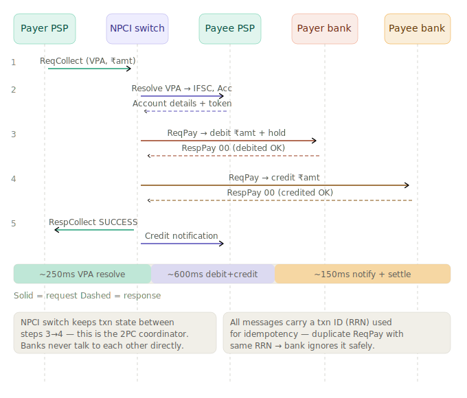
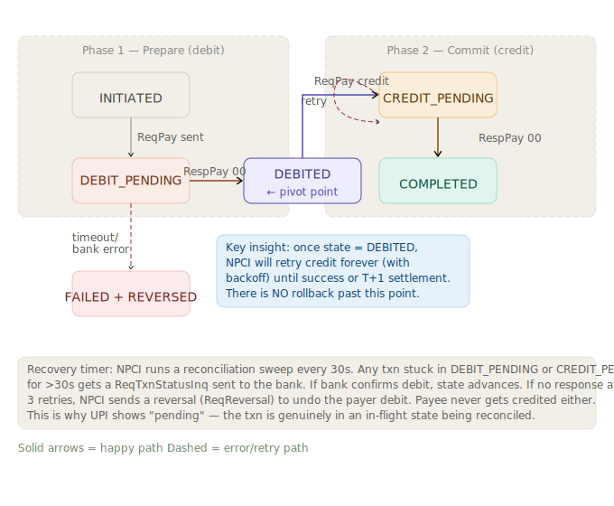
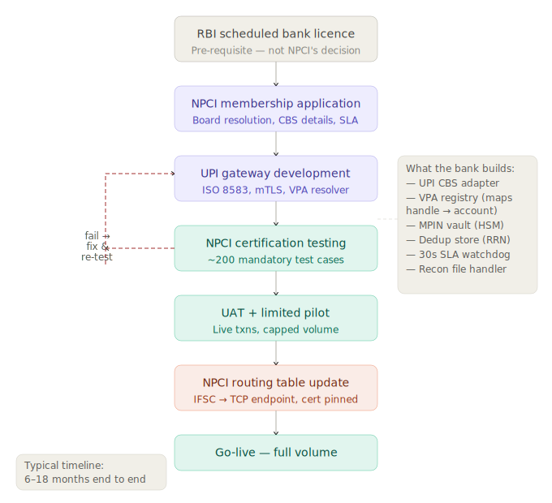
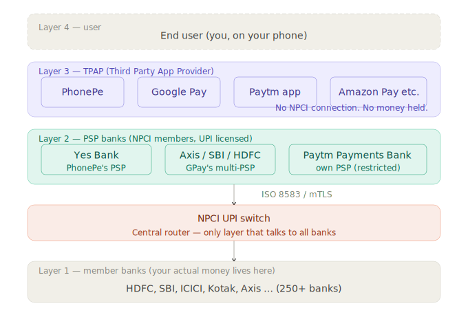
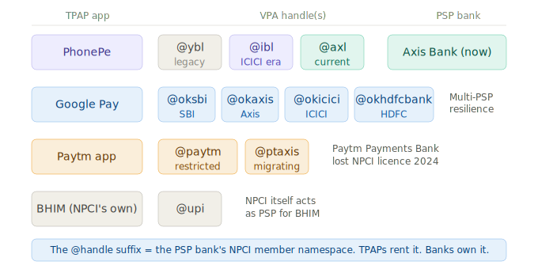

# UPI Architecture Deep Dive — How India Moves Money in Under 2 Seconds

> **Session Date:** 2026-06-26
> **Duration context:** Deep-dive (5 major topic threads, full architecture walkthrough)
> **Tags:** `#upi` `#payments` `#npci` `#distributed-systems` `#2pc` `#idempotency` `#system-design` `#india-fintech`

---

## Overview

This session covered the complete technical architecture of UPI (Unified Payments Interface) — India's real-time payments network — from the NPCI switch internals all the way down to how individual banks connect, how third-party apps like PhonePe and GPay fit in, and who actually pays for all of this. The session was driven by curiosity questions that progressively peeled back each layer: message flow → 2PC state machine → bank onboarding → TPAP vs PSP roles → economics.

This is excellent system design interview material and highly relevant to understanding distributed payments systems at national scale.

---

## Core Concepts

### 1. The Four Participants — and What Each One Actually Does

Every UPI transaction involves exactly four actors:

| Participant | Role | Holds money? | Talks to NPCI? |
|---|---|---|---|
| Payer PSP app (PhonePe, GPay) | UI and credential encryption | No | No — via PSP bank |
| PSP bank (Yes Bank, Axis) | NPCI gateway, VPA registry, HSM | No (for UPI) | Yes — ISO 8583 |
| NPCI switch | Message router, 2PC coordinator, state tracker | No | Hub to all |
| Member bank (HDFC, SBI) | CBS holds actual account balances | Yes | Yes — via NPCI |

The critical insight: **NPCI is not a bank. It holds no money. It is a pure message router with state tracking.** Similarly, PhonePe and GPay hold no money and have no direct NPCI connection.

---

### 2. The NPCI Switch — What It Actually Is

The switch is a cluster of active-active nodes (historically HP Tandem NonStop machines, now largely custom x86 clusters). Each node:

- Accepts **ISO 8583 messages** over persistent TCP connections (not REST, not HTTP)
- Maintains a **distributed transaction log** — every `ReqPay` is written to persistent storage before any bank is called
- Acts as **2PC coordinator** — never delegates coordination to banks
- Routes by **IFSC prefix** — `HDFC` → HDFC's TCP endpoint

The switch processes ~5,000–8,000 TPS on peak days (IPL finals, Diwali). Internal latency budget is under 100ms; the rest of the 2-second SLA is the banks.

**Why persistent TCP?** No TLS handshake overhead per transaction. Banks maintain long-lived connections. This alone saves ~50–100ms per transaction.

---

### 3. The Full Payment Message Flow

The complete sequence for a UPI payment:

```
Step 1: Payer PSP  → NPCI        ReqCollect (VPA, ₹amount)
Step 2: NPCI       → Payee PSP   Resolve VPA → IFSC, Account
Step 3: Payee PSP  → NPCI        Account details + token (response)
Step 4: NPCI       → Payer bank  ReqPay → debit ₹amount + hold
Step 5: Payer bank → NPCI        RespPay 00 (debited OK)
Step 6: NPCI       → Payee bank  ReqPay → credit ₹amount
Step 7: Payee bank → NPCI        RespPay 00 (credited OK)
Step 8: NPCI       → Payer PSP   RespCollect SUCCESS
Step 9: NPCI       → Payee PSP   Credit notification
```

Timing breakdown:
- ~250ms: VPA resolution
- ~600ms: debit + credit (bank CBS round-trips)
- ~150ms: notifications and settlement queuing

**Key structural fact:** Banks never talk to each other directly. All messages flow through NPCI. NPCI is the single coordinator.



---

### 4. The 2-Phase Commit — Asymmetric by Design

UPI uses a 2PC protocol where **Phase 1 is abortable but Phase 2 is not**. The six states:

```
INITIATED → DEBIT_PENDING → DEBITED (pivot) → CREDIT_PENDING → COMPLETED
                ↓                                     ↓ (retry loop)
           FAILED + REVERSED
```

**The DEBITED state is the point of no return.** Once a payer's account is debited:
- NPCI will retry the credit indefinitely (with exponential backoff: T+5s, T+15s, T+45s...)
- There is no rollback back past DEBITED
- If the payee bank never responds, the case escalates to T+1 settlement reconciliation

**Why no rollback past DEBITED?** Rolling back would require coordinating the payer bank again — another 2PC — which risks double-reversal. It is operationally simpler and safer to push the credit forward.

**Recovery sweep:** NPCI runs a reconciliation every 30 seconds. Any transaction stuck in DEBIT_PENDING or CREDIT_PENDING beyond 30s gets a `ReqTxnStatusInq` sent to the relevant bank. If no response after 3 retries → `ReqReversal` issued and payer gets money back.

**This is why UPI shows "pending"** — it is a genuine in-flight distributed state, not a UI delay.



---

### 5. Idempotency — The RRN Design

Every `ReqPay` carries a **Retrieval Reference Number (RRN)** — a 12-digit ISO 8583 field, globally unique per transaction.

**At NPCI level:** Redis/in-memory lookup before forwarding. If RRN exists and state is DEBITED/COMPLETED → return cached response, don't hit the bank again.

**At bank CBS level:** A dedup table keyed on RRN. If the same RRN arrives a second time (PSP retry after timeout), the bank returns the original response code without re-executing the debit.

**TTL:** 24 hours. After that the same RRN can theoretically be reused, but PSPs generate them with timestamp-based components to prevent this.

This is the mechanism that prevents double-charging even when connections drop mid-request. It is **mandatory under NPCI spec** — a bank that doesn't implement RRN dedup fails certification.

---

### 6. Bank Failure Scenarios

Three distinct failure modes, each with different outcomes:

#### Case 1 — Payer bank down before ReqPay (Safe)
- State never leaves `INITIATED`
- NPCI returns error code 91 (issuer/switch inoperative)
- No money moved. Safe to retry with a new RRN.

#### Case 2 — Payee bank down after payer debited (Retry loop)
- State is `DEBITED`. Payer's money has left.
- NPCI enters retry loop with exponential backoff
- User sees "Transaction pending" — this is a real distributed state
- If payee bank recovers within ~30 min: credit completes normally
- If no recovery: escalates to T+1 settlement file; reversal issued if credit can never be proved (T+3 days SLA)

#### Case 3 — Payer bank times out mid-debit (Ambiguous)
- State stuck in `DEBIT_PENDING`. NPCI doesn't know if money left.
- NPCI sends `ReqTxnStatusInq` with the original RRN
- Bank's dedup table responds: "debit succeeded" → advance to DEBITED, proceed with credit
- Bank's dedup table responds: "no record" → safe to mark FAILED
- **If bank is also down:** txn queued for T+1 reconciliation batch

The dual-debit protection comes from RRN idempotency at the CBS layer — same RRN arriving twice → bank returns same response, does not execute second debit.

---

### 7. The NPCI API Spec — What Banks Must Implement

NPCI publishes a **UPI Technical Specification v2.0** (~300 pages). Banks don't call NPCI — **NPCI calls the bank.** The spec mandates:

- **Protocol:** ISO 8583 over persistent TCP, wrapped in NPCI custom framing. Not REST.
- **Message types:** `ReqPay`, `RespPay`, `ReqTxnStatusInq`, `RespTxnStatusInq`, `ReqReversal`, `RespReversal`, `ReqBalEnq`, `ReqRegMob`, and ~15 others.
- **Response SLA:** 30 seconds per message. Timeout = NPCI treats it as failure and triggers reconciliation.
- **Availability SLA:** 99.5% uptime. NPCI publishes monthly "UPI Decline Report" per bank; RBI can act on chronic underperformers.
- **Security:** Mutual TLS. NPCI acts as CA — it issues certificates to banks. Certificate fingerprint is pinned in the routing table.

**The routing table entry (one per bank):**
```
IFSC_PREFIX → {tcp_endpoint, port, tls_cert_fingerprint, bank_member_id}
```

Example: `HDFC` → HDFC's UPI gateway endpoint. Every IFSC starts with a 4-letter bank code; NPCI uses this prefix for routing.

---

### 8. What Banks Actually Build

Behind the NPCI interface spec, each bank must implement:

| Component | Purpose |
|---|---|
| UPI CBS adapter | Translates ISO 8583 ↔ internal CBS format (Finacle/T24/Flexcube). Handles the impedance mismatch: CBS has 5s commit time; adapter holds NPCI connection open. |
| VPA registry | Maps `abhishek@hdfcbank` → account number + IFSC. Bank owns and controls its handle namespace. |
| MPIN vault (HSM) | Stores only salted hash of 6-digit PIN. PIN is encrypted on-device using bank's public key before leaving the PSP app. NPCI cannot see PINs — by design. |
| RRN dedup store | Redis/DB keyed on RRN, 30-day TTL. Every incoming ReqPay is checked here first. Mandatory under spec. |
| 30s SLA watchdog | Monitors pending transactions; triggers timeout response if CBS doesn't respond in time. |
| Recon file handler | Processes NPCI's T+1 settlement file; resolves ambiguous transactions from the previous day. |

---

### 9. Bank Onboarding Process

Getting a new bank onto UPI takes 6–18 months:

1. **RBI scheduled bank licence** — prerequisite, not NPCI's decision
2. **NPCI membership application** — board resolution, CBS details, SLA commitments
3. **UPI gateway development** — build all components listed above
4. **NPCI certification testing** — ~200 mandatory test cases (happy paths, error codes, timeout handling, idempotency verification, reversal flows, 100 TPS load test). Fail 3+ in one run → fix and re-apply.
5. **UAT + limited pilot** — live transactions at capped volume
6. **NPCI routing table update** — IFSC prefix registered, certificate pinned
7. **Go-live** — full volume

**Sub-member model:** ~1,500 co-operative banks can't build the full stack. A sponsor bank (Axis, Yes Bank) acts as technical proxy. Co-op bank's customers transact through the sponsor's UPI gateway; co-op bank gets a daily transaction feed.



---

### 10. TPAPs — Where PhonePe and GPay Actually Sit

**PhonePe and GPay are Third Party Application Providers (TPAPs)**. They:
- Have no NPCI membership
- Have no direct NPCI connection
- Hold no money
- Ride on top of a **PSP bank** that does have NPCI membership

The actual message path for a PhonePe payment:
```
PhonePe app → Yes Bank's UPI gateway → NPCI switch → Payer's bank CBS
```

From NPCI's perspective, the transaction is originated by Yes Bank. PhonePe is invisible at the switch layer.

**PSP bank's role:** Exposes a REST/HTTPS API to the TPAP (not ISO 8583 — that's internal). TPAP calls `POST /upi/pay` on the PSP bank API. PSP bank translates → ISO 8583 `ReqPay` → forwards to NPCI under its own member credentials.

**Commercial arrangement:** TPAP pays PSP bank a per-transaction fee (fraction of a paisa). PSP bank earns float. TPAP gets access to UPI rails without building bank-grade infrastructure.



---

### 11. The VPA Namespace — Who Owns `@ybl`?

The `@handle_suffix` belongs to the **PSP bank**, not the TPAP.

- `@ybl` = Yes Bank Limited (PhonePe's original PSP)
- `@axl` = Axis Bank (PhonePe's current PSP)
- `@oksbi`, `@okaxis`, `@okicici`, `@okhdfcbank` = GPay's four PSPs
- `@paytm` = Paytm Payments Bank (lost NPCI licence 2024)
- `@upi` = NPCI itself (for BHIM)

**The Yes Bank crisis (2020):** When Yes Bank hit RBI moratorium, PhonePe's `@ybl` handles were stuck in Yes Bank's VPA registry. PhonePe scrambled to migrate users first to `@ibl` (ICICI), then to `@axl` (Axis). Users had to update their UPI IDs.

**GPay's resilience design:** Deliberately spread across 4 PSP banks (`@oksbi`, `@okaxis`, `@okicici`, `@okhdfcbank`) so no single bank failure can take GPay down.

**Insight:** If you want to design for resilience as a TPAP, multi-PSP is the pattern. Single-PSP is a single point of failure you don't control.



---

### 12. Device Binding and MPIN — The Security Flow TPAPs Own

Even though TPAPs are invisible at NPCI, they own the critical UX security step: **device binding**.

```
Step 1: Mobile number verified via SIM (SMS sent from device)
Step 2: Device fingerprint (IMEI, hardware hash, SIM serial) registered with PSP bank
Step 3: Bank account discovery — NPCI multicasts ReqRegMob to all banks
         → "Who has an account with this mobile number?"
Step 4: MPIN setup — SDK encrypts 6-digit PIN using bank's public key ON DEVICE
         → Encrypted blob sent to PSP bank → passed to bank's HSM
         → HSM stores only the hash. PhonePe never sees plaintext PIN.
```

**The NPCI SDK** handles the MPIN screen, device binding, and credential encryption. TPAPs must use this SDK and cannot bypass it. This is why even a compromised PhonePe server cannot see your UPI PIN.

---

### 13. The Economics — Who Pays for All This?

#### The MDR kill

In the 2020 Union Budget, the government declared **zero MDR on UPI and RuPay transactions** — eliminating the fee that was supposed to fund the ecosystem. This broke the economics entirely.

#### Who absorbs the cost today

| Party | What they pay | What they get |
|---|---|---|
| Government (MeitY) | ₹2,000–3,500 Cr/year subsidy (reimbursement scheme) | UPI adoption as public infrastructure; digital economy growth |
| PSP banks | Net loss on UPI ops; CBS adapter + HSM + ops team | Customer acquisition; cross-sell of loans, insurance, deposits |
| TPAPs (PhonePe, GPay) | Cash burn (PhonePe lost ~₹2,000 Cr in FY23) | Market share; position to distribute financial products |
| NPCI | Switching fee (~₹0.50–1/txn from member banks) + cross-subsidy from NACH/FASTag/RuPay | Operates as Section 8 not-for-profit; funded by bank consortium |
| Member banks | NPCI switching fee + CBS infrastructure | Zero churn; rich transaction data for credit underwriting |

**Total ecosystem cost: ~₹6,000–10,000 Cr/year.** Government subsidy covers ~₹3,500 Cr. Rest is absorbed as strategic investment.

**NPCI's cross-subsidy:** NACH mandates, FASTag, NETC, and RuPay are profitable products that quietly fund UPI's infrastructure.

#### The 30% market cap problem

NPCI imposed a rule: no single TPAP can exceed 30% of UPI volume. As of 2026, PhonePe is at ~48%, GPay at ~37%. Neither has complied. NPCI hasn't enforced because throttling them would hurt UPI adoption metrics. The deadline has been extended repeatedly.

#### The real monetisation bet — UPI credit

Everyone is waiting to unlock:
- **UPI on credit cards (RuPay):** 1.5–2% MDR applies → revenue exists again
- **Pre-sanctioned credit lines on UPI (BNPL):** MDR kicks in when credit is drawn
- **UPI for international (India-UAE, India-Singapore, India-Bhutan):** Forex spread is revenue
- **UPI Lite:** Sub-₹500 transactions from on-device wallet, bypassing NPCI switch — reduces infrastructure load but also reduces transaction data banks can use

**The real business model:** PhonePe's path to profitability isn't payments. It's PhonePe Wealth, PhonePe Insurance, PhonePe Loans — all distributed through an app 500M+ people open daily. The UPI infrastructure cost is the customer acquisition cost.

---

## Comparisons & Tradeoffs

### UPI vs Visa/Mastercard model

| Aspect | UPI (NPCI) | Visa/Mastercard |
|---|---|---|
| Network type | Hub-and-spoke, NPCI as single coordinator | Decentralised, bilateral bank agreements |
| Message format | ISO 8583 over TCP | ISO 8583 / proprietary over HTTP |
| MDR | Zero (mandated) | 1.5–2.5% (negotiated) |
| Settlement | Intraday message + T+1 net batch (RTGS) | T+1/T+2 net settlement |
| Revenue model | Broken (government subsidy + cross-subsidy) | Interchange fees fund entire ecosystem |
| Who coordinates 2PC | NPCI switch | Each bank pair bilaterally |

### TPAP vs PSP Bank

| Aspect | TPAP (PhonePe, GPay) | PSP Bank (Yes Bank, Axis) |
|---|---|---|
| NPCI membership | No | Yes |
| Holds money | No | No (for UPI flows) |
| Connects to NPCI switch | No | Yes (ISO 8583, mTLS) |
| Owns VPA namespace | No — rents from PSP bank | Yes |
| Revenue on UPI P2P | Zero | Near-zero (per-txn fee from TPAP) |
| Competitive moat | App UX, merchant coverage, financial products | UPI lane as distribution for own financial products |

### Single-PSP vs Multi-PSP (TPAP resilience design)

| Aspect | Single PSP (old PhonePe/@ybl) | Multi-PSP (GPay: 4 banks) |
|---|---|---|
| Failure risk | PSP bank outage = full outage | One PSP bank fails → route to others |
| VPA migration risk | PSP partnership breaks → user migration chaos | Distributed risk |
| Operational complexity | Simple | Higher (multiple API integrations) |
| Example lesson | PhonePe-Yes Bank crisis 2020 | GPay designed for this from the start |

---

## Key Takeaways

- **NPCI is TCP/IP, PSP banks are ISPs, TPAPs are apps.** The network layer, the access layer, and the application layer are completely separate concerns.
- **DEBITED is the point of no return** in UPI's 2PC. Once money leaves the payer, NPCI is committed to completing the credit — not rolling back. The 2PC is deliberately asymmetric.
- **RRN idempotency is the safety net for retries.** Every timeout/network failure scenario is safe because banks are required to implement RRN dedup at the CBS layer. Same RRN = same response, no second execution.
- **"Pending" is a real distributed state,** not a UI problem. The transaction is genuinely in DEBIT_PENDING or CREDIT_PENDING and being actively reconciled by NPCI's 30s sweep.
- **The @handle suffix is owned by the PSP bank, not the app.** `@ybl` is Yes Bank's, not PhonePe's. This is a structural dependency that caused the 2020 crisis and shaped GPay's multi-PSP strategy.
- **Zero MDR broke the economics.** The government made a political bet that financial inclusion > short-term funding. The ecosystem now runs on government subsidy + strategic loss absorption + a bet on UPI credit monetisation.
- **UPI credit (BNPL lines, credit card-linked UPI) is where MDR-like revenue will come from.** Everything built so far — the user base, the merchant integrations, the transaction data — is the acquisition cost for the credit business.
- **NPCI's profitable businesses (NACH, FASTag, NETC) cross-subsidise UPI.** NPCI is a Section 8 not-for-profit, not a charity — it has real revenue, just not from UPI switching fees.
- **The 30% cap is politically unenforceable.** PhonePe at 48% and GPay at 37% are too embedded to throttle without hurting the metrics that justify the government subsidy.
- **The bank onboarding spec is a "certificate of conformance" model.** NPCI doesn't care how the CBS works internally — only that the external ISO 8583 interface passes ~200 test cases. This is why 250+ banks with wildly different CBS vendors can interoperate.

---

## Open Questions / Next Steps

- **UPI Lite off-switch architecture:** Sub-₹500 transactions bypass NPCI entirely via on-device wallet. How does the device-side settlement work, and what are the security tradeoffs?
- **UPI on credit cards (full flow):** When a RuPay credit card is linked to UPI, how does the ReqPay route? Does it look different at the NPCI switch layer?
- **Cross-border UPI (India ↔ Singapore PayNow):** Two different switch architectures (NPCI vs FAST/PayNow) — what's the bridging layer?
- **NPCI's 30% cap enforcement mechanism:** Technically, how would NPCI throttle a TPAP? Rate limiting at the PSP bank layer? Or at the NPCI switch itself?
- **UPI fraud detection:** NPCI's fraud scoring happens in-line (pre-routing) or async (post-routing)? What's the model?
- **Paytm Payments Bank post-mortem:** What exactly triggered the RBI restrictions in 2024, and what was the actual regulatory violation vs the public explanation?

---

## References

- NPCI UPI Technical Specification v2.0 (not publicly downloadable; referenced in RBI circulars)
- RBI circular on zero MDR (January 2020) — `https://www.rbi.org.in/`
- NPCI UPI product overview — `https://www.npci.org.in/what-we-do/upi/product-overview`
- ISO 8583 standard — financial transaction message format
- PhonePe FY23 annual report (for operating loss figures)
- MeitY incentive scheme for digital payments — Union Budget 2023-24 and 2024-25 documents
- RBI Report on Currency and Finance 2022-23 (UPI infrastructure cost estimates)
