# WhatsApp System Design — Deep Dive

> A complete breakdown of how WhatsApp delivers messages to 2 billion users: protocol stack, delivery ticks, notification architecture, and the distributed systems trade-offs behind every design decision.

---

## Table of Contents

1. [The "Maybe" Problem](#the-maybe-problem)
2. [What the Server Does When a Message Arrives](#what-the-server-does-when-a-message-arrives)
3. [How Delivery Ticks Work](#how-delivery-ticks-work)
4. [How XMPP Delivery Works](#how-xmpp-delivery-works)
5. [What Happens When You Open WhatsApp After a Notification](#what-happens-when-you-open-whatsapp-after-a-notification)
6. [What Happens to Queued Messages When You Come Back Online](#what-happens-to-queued-messages-when-you-come-back-online)

---

## The "Maybe" Problem

WhatsApp says **"You may have new messages."** Not "You have 3 new messages." Not "You have no messages." Just… maybe.

This isn't a bug. It's a precise, honest response to a fundamental distributed systems constraint.



### The two paths are architecturally independent

WhatsApp's delivery system runs over a persistent **TCP/XMPP connection** between the app and the server. When you're online, messages arrive over that socket, the app ACKs them, and the server fires the tick sequence. This is reliable, ordered, and confirmed.

The **notification system** is completely separate — it routes through Apple's APNs or Google's FCM, which are fire-and-forget relays that WhatsApp has no visibility into. WhatsApp hands the notification to Apple, and Apple says "we'll try."

### The race condition is unavoidable

The push notification can reach your lock screen before your phone has re-established its TCP socket with WhatsApp's servers. At that moment the app has exactly one true fact: *a push event occurred.* It does not know whether:

- The message is waiting in the queue
- It already arrived during a brief earlier connection
- The notification is stale

So the only honest string is **"you may have new messages"** — it's epistemically correct.

### The word "may" is a CAP theorem artifact

You're in a window of network partition between the notification delivery system and the message delivery system. The app is choosing **availability** (show something) over **consistency** (show something accurate).

It could refuse to show a notification until it had a confirmed count from the XMPP layer — but that would require the phone to have an open socket before it could wake the app at all, defeating the entire purpose of background notifications on iOS.

### Resolution is deterministic

The moment you tap the notification and the app opens, the TCP connection re-establishes, the server flushes the message queue, ACKs come back, and the count resolves instantly. "Maybe" was never permanent — it was exactly as long-lived as the gap between those two paths.

> **Interview follow-up to anticipate:** *Why not synchronize the two paths before firing the push notification?*
> Because that would require waiting for TCP confirmation before sending the push, which adds latency to every notification and couples two systems intentionally decoupled for resilience. The soft wording is the cheap, correct answer to an inherent distributed systems race.

---

## What the Server Does When a Message Arrives

### Store first, route second

The message hits an ingestion layer that immediately persists it to **durable storage** — this is what earns the sender their first grey tick. The message is now safe even if everything downstream fails. Only after that write is confirmed does routing begin.

### Recipient lookup

The server checks whether the recipient's device has an active TCP/XMPP connection. This is the fork that determines everything else:

- **Socket is open** — message pushed directly over the connection. Server waits for a delivery ACK from the recipient's app. When it arrives, the sender's tick flips to double-grey (delivered).
- **Socket is closed** — message stays in the queue and the server fires a push notification via APNs or FCM, holding the message until a connection is established.

### Queue management

The server maintains a **per-user message queue**. Messages accumulate there until the recipient comes online, at which point the queue flushes in order. This is why opening WhatsApp after being offline shows messages in the correct sequence rather than arriving randomly.

### Multi-device fan-out

WhatsApp supports linked devices, so the server fans the message out to **every registered device** for that account, tracking delivery state independently for each. A message can be delivered to your phone but still queued for your desktop.

### End-to-end encryption is transparent to the server

The server routes **ciphertext it cannot read**. Key exchange (via the Signal Protocol) happened at registration time, so the server never sees plaintext — it's moving opaque encrypted blobs and tracking their delivery state.

### Tick bookkeeping

The server maintains the tick state machine throughout:

| State | Trigger |
|---|---|
| Message received (1st tick) | Server writes to durable store |
| Delivered to device (2nd tick) | Recipient app sends delivery ACK |
| Read by user (blue ticks) | Recipient opens the chat window |

Each transition is an immutable fact confirmed by an explicit ACK — nothing is inferred or assumed.

---

## How Delivery Ticks Work

The tick system is a small, precise state machine running across three participants — sender, server, and recipient — with each transition triggered by an explicit ACK.



### 🕐 Clock icon → ✓ Single grey tick

**Trigger: server ACK**

The moment WhatsApp's servers write the message to durable storage, they send an acknowledgement back to the sender's device. The app flips from the clock icon to a single grey tick.

> This tick means exactly one thing: *the server has it.* The recipient's existence is irrelevant at this point.

### ✓ → ✓✓ Double grey tick

**Trigger: recipient device ACK**

When the recipient's app receives the message over TCP and successfully decrypts it, it sends a **delivery receipt** back to the server. The server then forwards a delivery notification to the sender. Double grey means *the device has it* — not that the person has seen it.

### ✓✓ → 🔵✓✓ Blue ticks

**Trigger: read receipt**

Fires when the recipient actually opens the chat window. The app sends a read receipt to the server, which relays it to the sender.

This is **opt-out** — if the recipient disables read receipts, this step never fires. Notably, if you disable read receipts, you also stop receiving them from others. WhatsApp enforces this symmetry.

### The single-tick waiting state

If the recipient is offline, the message sits in the server queue and the sender is stuck on one tick. There's no timeout or estimated delivery. The tick doesn't advance until a delivery ACK comes back.

You can see a single tick for days if someone has their phone off, then watch it jump straight to double grey (or even blue, if they open WhatsApp immediately) the instant they reconnect.

### Multi-device complicates this

With linked devices, the server tracks tick state **per-device independently**. The displayed tick on the sender's side typically reflects the most advanced state across all recipient devices.

> The elegance here is that the tick system requires no polling and no timeouts — it's entirely event-driven, with each state transition being an immutable fact confirmed by an explicit ACK.

---

## How XMPP Delivery Works

WhatsApp started on XMPP but has moved away from standard XMPP. Conflating "WhatsApp uses XMPP" with "WhatsApp uses *standard* XMPP" is a common interview mistake.



### The protocol stack

```
Signal Protocol payload      ← encrypted message content
FunXMPP                      ← WhatsApp's binary-encoded XMPP fork
Noise Protocol               ← E2E session encryption + device auth
TCP (port 443 or 5222)       ← transport
```

### The XMPP foundation

WhatsApp launched in 2009 built on XMPP — the open messaging protocol originally designed for instant messaging. XMPP's core idea is well-suited to chat: persistent TCP connections, a presence model (online/offline/away), and a stanza-based message format where each message is a discrete unit that can carry metadata alongside content.

### Why they forked it into FunXMPP

Standard XMPP uses XML, which is verbose. A simple delivery receipt in standard XMPP might be 200+ bytes of XML. WhatsApp replaced the XML serialization with a **custom binary token encoding** — every tag name and common attribute is replaced with a single byte from a lookup table. The same stanza drops to roughly 60–70 bytes.

At 2 billion users sending hundreds of billions of messages a day, that difference is enormous. The semantics stay XMPP-like; only the wire format changes.

### The encryption layer

Before any XMPP stanza is exchanged, the connection goes through the **Noise Protocol handshake** — establishing session encryption and authenticating device identity. The Signal Protocol encrypted payload then sits *inside* the FunXMPP stanza.

The server handles delivery but never sees message plaintext. It's routing opaque blobs.

### The stanza ACK drives ticks

Every delivered message gets a **per-stanza ACK** sent back from the recipient app to the server. This is explicit and synchronous — the server holds the message as undelivered until that ACK arrives. No polling, no timeout-based assumption — just the presence or absence of that ACK.

### Keepalives solve the silent TCP problem

TCP connections can die without either side being told — a phone switches from WiFi to cellular, a NAT table entry expires, a middlebox silently drops the connection.

WhatsApp sends a **ping every ~30 seconds** and expects a pong back. If the pong doesn't arrive, the connection is declared dead and the full reconnect sequence begins. Without this, a device could believe it has an active connection while the server has already discarded it.

### Why port 443?

Standard XMPP runs on port 5222, which corporate firewalls and carrier networks commonly block. Port 443 is the HTTPS port — virtually nothing blocks it, because doing so would break the web. WhatsApp's traffic is TLS-shaped and arrives on 443, so it passes through hostile networks that would otherwise drop it.

> **The honest interview answer:** WhatsApp's "XMPP" is really a proprietary protocol that borrowed XMPP's connection model and presence semantics, replaced everything else, and layered Signal Protocol on top. Calling it XMPP is like calling a car an "internal combustion vehicle" — technically traceable, but missing most of what actually matters.

---

## What Happens When You Open WhatsApp After a Notification

This is where the "maybe" collapses into certainty. Several things race in parallel the instant the app foregrounds.



### Step 1 — OS hands control to the app

When you tap the notification, the OS foregrounds WhatsApp and delivers the intent. The push payload is **deliberately thin** — it might contain a sender ID or a flag saying "you have messages," but not the message content. Actual content must come over the Signal Protocol session.

### Step 2 — TCP reconnect (the critical path)

The app immediately initiates a TCP connection and runs the **Noise Protocol handshake** to re-key the session and verify device identity. This is the slowest part — typically **100–400ms** depending on network conditions. Everything else waits on this.

### Step 3 — Queue flush (nearly instantaneous once connected)

The server has been holding messages in an ordered queue, ready to deliver. The moment presence is registered on the new socket, the server starts pushing them down. Because they were already serialized and waiting, the flush itself is fast — the latency you perceive is almost entirely the handshake, not the message transfer.

### Step 4 — Three things happen simultaneously

The moment messages arrive:

1. **UI renders them** — resolving the vague count to an exact number
2. **Stanza ACKs sent** — one per message, triggering the server to notify senders (their ticks flip from single to double grey)
3. **Read receipt fires** — if you've landed directly in the relevant chat, blue ticks appear on the sender's side before you've consciously registered opening the app

### The "maybe" was always going to be brief

That hedged string exists only for the window between the push notification arriving and the TCP path completing. Once the socket is live and the queue is flushed, the system has hard facts again and the UI snaps to precision.

**Typical wall-clock time: 200–800ms on a good connection.** The TCP + Noise handshake dominates. Queue flush is fast — it was already waiting.

> WhatsApp feels faster than it technically should because the app starts reconnecting the moment it enters the foreground — before the UI has fully rendered. By the time your thumb completes the tap gesture, the handshake is often already in flight.

---

## What Happens to Queued Messages When You Come Back Online

Five things happen in a precise sequence the moment your TCP connection re-establishes.



### Step 1 — TCP connect and Noise handshake (the slow part)

Everything else waits on this. The app opens a TCP connection to WhatsApp's servers and runs the Noise Protocol handshake to re-key the session and verify the device's identity keypair. This is **100–400ms** depending on network conditions and is the dominant cost of the entire reconnect sequence.

### Step 2 — Presence registration (triggers the flush)

Once the session is established, the app announces its presence to the server. The server marks the socket as active and immediately begins flushing the queue. There is no delay between presence registration and flush start — it happens in the same logical transaction.

### Step 3 — Ordered queue flush

Messages are pushed down the socket **oldest-first**, in the exact sequence they were received by the server. This is why you see messages in the right chronological order even after days offline. The server maintains sequence numbers on the queue so ordering is guaranteed regardless of how many senders they came from.

### Step 4 — Stanza ACK cascade

As each message arrives and is decrypted, the app fires a per-message stanza ACK back to the server. The server fans these out to the original senders — one delivery receipt per message, routed to whichever sender sockets are currently open.

If a sender is also offline, their delivery receipts are themselves queued and delivered when they reconnect. Nothing is discarded.

### Step 5 — Tick resolution on senders

Each delivery receipt causes a tick flip on the sender's UI: ✓ jumps to ✓✓. If the recipient opened WhatsApp directly into a chat already on screen, the read receipt fires immediately after — meaning the sender can see ✓ → ✓✓ → blue happen in rapid succession, or even jump straight to blue if processing is fast enough.

### The queue is not infinite

WhatsApp holds queued messages for approximately **30 days**. After that, the server discards them and the sender's tick stays permanently at single grey. This is the only scenario where a single tick is a terminal state rather than a waiting one.

### Multi-device adds a wrinkle

Each linked device has its own independent queue. If your phone reconnects before your desktop, the phone gets the flush and fires ACKs — the sender sees ✓✓ — but the desktop queue is still pending. The sender's visible tick reflects the most advanced state across all your devices.

### Timing breakdown

| Phase | Typical duration |
|---|---|
| TCP + Noise handshake | 100–400ms |
| Presence registration + flush start | ~10ms |
| Per-message stanza ACK | ~5ms each |
| Sender tick update (delivery notice) | ~50ms |

> The queue flush itself is nearly instant — the messages were already serialized and waiting. All the latency you perceive is the handshake, not the transfer.

---

## Key Concepts Summary

| Concept | What it means |
|---|---|
| FunXMPP | WhatsApp's binary fork of XMPP — ~3× smaller frames than XML |
| Noise Protocol | Session encryption and device authentication layer |
| Signal Protocol | End-to-end encrypted payload — server routes blobs it cannot read |
| Stanza ACK | Per-message receipt from recipient app → triggers ✓✓ on sender |
| Keepalive ping | ~30s interval ping/pong — detects silent TCP drops |
| Push payload | Deliberately thin — no message content, just a wake signal |
| Queue flush | Server holds messages until socket is live, then pushes in order |
| 30-day retention | Server discards undelivered messages after ~30 days — single tick becomes terminal |
| Late delivery ACK | Offline recipient reconnects, ACK fires, sender's ✓ jumps to ✓✓ retroactively |
| "Maybe" window | Gap between push notification arrival and TCP delivery confirmation |

---

## Assets

All SVG diagrams are located in `assets/whatsapp/`:

- `whatsapp_delivery_vs_notification.svg` — delivery path vs notification path, where "maybe" lives
- `whatsapp_tick_state_machine.svg` — complete tick state machine with online and offline branches
- `whatsapp_xmpp_protocol_stack.svg` — protocol stack and connection lifecycle
- `whatsapp_app_open_sequence.svg` — parallel reconnect sequence when app foregrounds
- `whatsapp_queue_flush_sequence.svg` — five-step queue flush sequence when recipient comes back online
